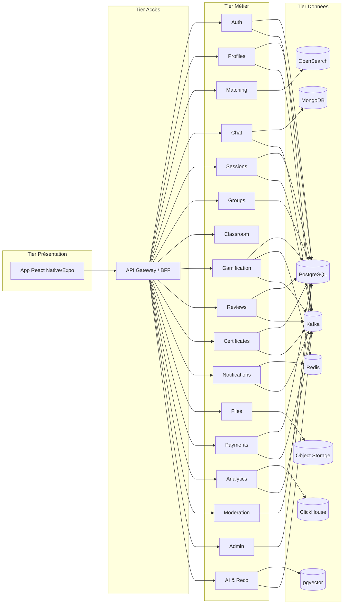
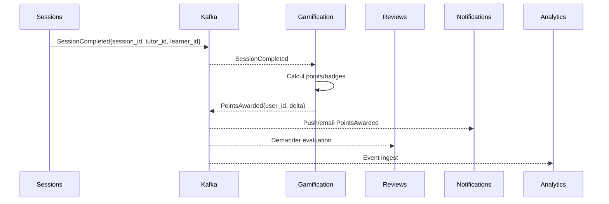

# SkillSwap — MVP

> **Question :** *Quelles sont les fonctionnalités requises pour le MVP de SkillSwap (avec taille et priorité) ?*

<details>
<summary><b>🧭 Légende</b></summary>

- **Taille** : `S` · `M` · `L` · `XL`  
- **Priorité** : 🔴 `P0` (critique) · 🟠 `P1` (haute) · 🟡 `P2` (moyenne) · ⚪ `P3` (basse)
</details>

| ✨ Fonctionnalité (MVP) | 📏 Taille | 🎯 Priorité |
|---|---:|:---:|
| Auth email/mot de passe | `S` | 🔴 `P0` |
| OAuth Google | `S` | 🟠 `P1` |
| Vérification email | `S` | 🔴 `P0` |
| Vérification téléphone (OTP) | `M` | 🟠 `P1` |
| Profil utilisateur (bio, photo, localisation approx.) | `M` | 🔴 `P0` |
| Déclarer “J’enseigne / J’apprends” + niveau + dispo | `M` | 🔴 `P0` |
| Tags de compétences & langues | `S` | 🔴 `P0` |
| Mini-vidéo de présentation (≤30s) | `M` | 🟡 `P2` |
| Upload certificats/diplômes | `M` | 🟠 `P1` |
| Vérification certificats (manuel) + badge “Certifié” | `M` | 🟡 `P2` |
| KYC léger identité (badge “Vérifié”) | `M` | 🟡 `P2` |
| Matching basique (compétences, distance, dispo) | `L` | 🔴 `P0` |
| Filtres: rayon, niveau, langue, présentiel/distanciel | `M` | 🔴 `P0` |
| Recherche par mots-clés | `S` | 🔴 `P0` |
| Chat 1-1 temps réel (texte) | `M` | 🔴 `P0` |
| Partage de fichiers (PDF/images) dans le chat | `M` | 🟠 `P1` |
| Notifications push/email (messages, sessions) | `M` | 🔴 `P0` |
| Traduction instantanée basique du chat | `M` | 🟠 `P1` |
| Proposer/Confirmer une session (date, lieu/visio) | `M` | 🔴 `P0` |
| Rappels automatiques de session | `S` | 🔴 `P0` |
| Lien visioconf (WebRTC/Zoom minimal) | `L` | 🟠 `P1` |
| Mode hors-ligne minimal (profils consultables) | `M` | 🟡 `P2` |
| Historique messages en cache (lecture seule hors-ligne) | `M` | 🟡 `P2` |
| Évaluations: étoiles + critères | `M` | 🔴 `P0` |
| Avis textuels + signaler contenu | `M` | 🟠 `P1` |
| Votes “utile” sur avis | `S` | 🟡 `P2` |
| Score de fiabilité (no-show/annulation tardive) | `M` | 🟠 `P1` |
| Gamification: points clés (enseigner, participer, avis) | `M` | 🟠 `P1` |
| Badge “Certifié” (auto via vérif diplôme) | `S` | 🟡 `P2` |
| Classement basique (Weekly Top 10) | `M` | 🟠 `P1` |
| Stats perso simples (sessions, points) | `S` | 🟡 `P2` |
| Signalement & blocage d’utilisateurs | `S` | 🔴 `P0` |
| Modération IA simple (toxicité) | `M` | 🟡 `P2` |
| Masquage localisation précise (privacy) | `S` | 🔴 `P0` |
| RGPD: consentements, export/suppression compte | `M` | 🔴 `P0` |
| Paramètres notifications & langues (i18n FR/EN) | `M` | 🟠 `P1` |
| Onboarding guidé (tuto + premiers matchs) | `M` | 🟠 `P1` |
| Admin minimal (modération, vérifs, bans) | `M` | 🔴 `P0` |
| Rate-limit & sécurité API (Helmet, CORS) | `S` | 🔴 `P0` |
| Stockage fichiers  | `M` | 🟠 `P1` |
| Scan antivirus basique à l’upload | `M` | 🟡 `P2` |
| Logs & crash reporting  | `S` | 🟠 `P1` |
| Observabilité minimale (métriques) | `S` | 🟡 `P2` |
| Groupes collaboratifs simples (création + membres) | `L` | 🟡 `P2` |
| Forum de groupe (fils basiques) | `L` | 🟡 `P2` |
| Tâches/devoirs simples (deadline, pièces jointes) | `M` | 🟡 `P2` |
| 2FA optionnelle | `M` | ⚪ `P3` |
| Messages vocaux | `M` | ⚪ `P3` |
| Breakout rooms / tableau blanc | `L` | ⚪ `P3` |
| Abonnements/paiements (Premium/VIP) | `XL` | ⚪ `P3` |
| Mode Écoles/Universités (classes, exports) | `XL` | ⚪ `P3` |


TP2:# SkillSwap — Conception d’Architecture N-Tiers

> Application mobile sociale d’échange de compétences (apprendre/enseigner) avec gamification, groupes, IA et classe virtuelle.  
> **Matière : Conception d’architecture n-tiers** — focus sur *modélisation & découpage*, pas de code.


---

## Sommaire
- [1. Objectif & Problèmes](#1-objectif--problèmes)
- [2. Vision N-Tiers](#2-vision-n-tiers)
- [3. Découpage par domaines (microservices)](#3-découpage-par-domaines-microservices)
- [4. Choix des bases (polyglot persistence)](#4-choix-des-bases-polyglot-persistence)
- [5. Modélisation des données (extraits)](#5-modélisation-des-données-extraits)
- [6. Flux & Intégration](#6-flux--intégration)
- [7. Sécurité, Conformité, Observabilité](#7-sécurité-conformité-observabilité)
- [8. Roadmap Architecture](#8-roadmap-architecture)
- [9. Diagrammes Mermaid](#9-diagrammes-mermaid)
- [10. Annexes & Glossaire](#10-annexes--glossaire)
- [11. Exigences non-fonctionnelles (NFR)](#11-exigences-non-fonctionnelles-nfr)
- [12. SLO / SLA & Observabilité](#12-slo--sla--observabilité)
- [13. RGPD & Rétention](#13-rgpd--rétention)
- [14. Modèle de menaces (STRIDE)](#14-modèle-de-menaces-stride)
- [15. Continuité d’activité (BCP/DRP)](#15-continuité-dactivité-bcpdrp)
- [16. Catalogue d’événements (extraits)](#16-catalogue-dévéments-extraits)
- [17. Contrats d’API (exemples minimaux)](#17-contrats-dapi-exemples-minimaux)
- [18. Conventions & Versioning](#18-conventions--versioning)
- [19. Environnements & Secrets](#19-environnements--secrets)
- [20. Hypothèses & Limites](#20-hypothèses--limites)
- [21. Checklist soutenance / revue d’architecture](#21-checklist-soutenance--revue-darchitecture)
- [22. Risques & Mitigations](#22-risques--mitigations)
- [23. Glossaire (complément)](#23-glossaire-complément)
- [Mon avis](#mon-avis-bref)

---

## 1. Objectif & Problèmes
**But :** apprentissage communautaire, motivant, accessible.  
**Douleurs ciblées :** coût/rigidité des cours, faible motivation, crédibilité (scams), barrières linguistiques, besoin d’une plateforme unifiée moderne, usage hors-ligne.

---

## 2. Vision N-Tiers
**Tier Présentation** (mobile) → **Tier Accès** (API Gateway/BFF) → **Tier Métier** (services domaines) → **Tier Données** (stores spécialisés) → **Tier Analytique** (OLAP/temps réel).  
**Style :** orienté événements (pub/sub) pour découplage, réactivité et scalabilité.

---

## 3. Découpage par domaines (microservices)

| Domaine | Rôle (métier) | Exemples d’API/contrats |
|---|---|---|
| **API Gateway / BFF** | Routage, agrégation, rate-limit, traduction d’erreurs | REST/GraphQL, JWT pass-through |
| **Auth & Comptes** | Identité, OAuth/2FA, RGPD | `POST /auth/login`, `DELETE /users/{id}` |
| **Profils & Compétences** | Profils, langues, dispo, vidéo 30s | `GET /profiles/{id}` |
| **Matching & Recherche** | Matching multi-critères, géo, réputation | `POST /match/query` |
| **Chat & Traduction** | 1-1/groupe, fichiers, traduction live | WebSocket events |
| **Sessions & Planning** | Proposer/Confirmer, rappels, fiabilité | `POST /sessions` |
| **Groupes & Forums** | Groupes, rôles, fils, tâches | `POST /groups` |
| **Classe Virtuelle** | Visioconf, whiteboard, replays | `POST /classrooms` |
| **Gamification** | Points, badges, classements | `POST /points/apply` |
| **Avis & Réputation** | Étoiles + critères, votes utiles | `POST /reviews` |
| **Certificats & KYC** | Diplômes, vérif, badges | `POST /certificates` |
| **Notifications** | Push/email, templates, préférences | `POST /notify` |
| **Fichiers** | Stockage objet, antivirus, URLs signées | `POST /files` |
| **Abonnements & Paiements** | Plans, factures, webhooks | `POST /subscriptions` |
| **Analytics & Stats** | KPIs temps réel, tableaux | `POST /events/ingest` |
| **Modération** | IA/assistée, blocage | `POST /moderation/check` |
| **Admin Console** | Support, audit, exports | `GET /admin/...` |
| **Reco & IA Agents** | Mentor/Assistant/Copilote, embeddings | `POST /ai/assist` |

> Recommandation : commencer avec ~8 services (Auth, Profils, Matching, Chat, Sessions, Avis, Notifications, Admin), puis étendre.

---

## 4. Choix des bases (polyglot persistence)

| Service | Base | Justification |
|---|---|---|
| Auth, Profils, Sessions, Groupes, Avis, Paiements, Certifs, Admin, Modération | **PostgreSQL** | Intégrité ACID, contraintes, audit |
| Matching & Recherche | **OpenSearch/Elasticsearch** | Full-text, géo, scoring custom |
| Chat | **MongoDB** (+ TTL) | Volume messages, schéma souple |
| Caches/Queues/Classements | **Redis** (ZSET/Streams) | Latence, leaderboard, temps réel |
| Fichiers/Replays | **S3-compatible** | Stockage objet, URLs signées |
| Analytics | **ClickHouse** | Agrégations rapides, coûts bas |
| Reco IA (similarité) | **pgvector** (ou Vector DB) | Embeddings, recherche par similarité |

---

## 5. Modélisation des données (extraits)

**Profils (PostgreSQL)**  
- `profiles(user_id PK, display_name, bio, approx_location POINT, languages text[], availability jsonb, avatar_url, intro_video_url)`  
- `user_skills(user_id, skill, level, direction)` *(teach/learn)*

**Sessions (PostgreSQL)**  
- `sessions(id, tutor_id, learner_id, mode, start_at, end_at, place, status)`  
- `session_events(id, session_id, type, at)`

**Chat (MongoDB)**  
- `conversations{ _id, type, members[], created_at }`  
- `messages{ _id, conv_id, sender, kind(text|voice|file), body, created_at }` *(TTL possible)*

**Gamification (PostgreSQL + Redis)**  
- `points_ledger(id, user_id, reason, delta, ref_id, at)`  
- Classements périodiques en **Redis ZSET** (Daily/Weekly/Monthly/Yearly).

**Analytics (ClickHouse)**  
- `events(ts, user_id, type, props)` *(sessions, tâches, badges…)*

---

## 6. Flux & Intégration
- **Synchrone :** REST/GraphQL via **API Gateway/BFF** ; **WebSocket** (Socket.io) pour chat/notifs.  
- **Asynchrone :** **Kafka/Redpanda** (ex. `SessionCompleted`, `PointsAwarded`, `CertificateVerified`, `ReviewAdded`).  
- **Indexation :** pipelines → OpenSearch (profils/skills/réputation).  
- **Idempotence :** paiements, points, webhooks (clés de déduplication).

---

## 7. Sécurité, Conformité, Observabilité
- **Sécurité :** OAuth2/JWT, scopes, mTLS inter-services, Helmet, CORS, rate-limit, antivirus fichiers, secrets manager.  
- **Conformité :** RGPD (consentement, export/suppression compte, minimisation, rétention), KYC léger, masquage géoloc précise.  
- **Observabilité :** OpenTelemetry, logs corrélés, **SLOs** (latence BFF, délivrabilité notifs, erreurs chat), alerting.

---

## 8. Roadmap Architecture
- **MVP (1.0)** : Auth, Profils, Matching/Search, Chat texte, Sessions, Avis, Notifications, Admin min, RGPD.  
- **1.1 Confiance** : OAuth, OTP téléphone, certificats, fichiers chat, trad basique, score fiabilité, points + Top10.  
- **1.2 Communauté** : vidéo profil, KYC léger, offline profils/histo, votes utiles, stats perso, modération IA, groupes/tâches.  
- **2.0 Premium** : 2FA, vocaux, visioconf/whiteboard/breakouts, replays, abonnements, mode Écoles, analytics avancées, IA étendue.

---

## 9. Diagrammes Mermaid

### 9.1. Vue N-Tiers (C4 “containers”)



### 9.2. Flux d’événements (ex. fin de session)



---

## 10. Annexes & Glossaire
- **N-Tiers** : séparation Présentation / Accès / Métier / Données / Analytique.  
- **Polyglot persistence** : chaque domaine choisit le store optimal.  
- **Event-Driven** : événement = contrat d’intégration, faible couplage.  
- **BFF** : façade mobile (agrège, simplifie, stabilise).

---

## 11. Exigences non-fonctionnelles (NFR)

| Domaine | Cible | Note |
|---|---:|---|
| Disponibilité BFF | 99.9% mensuel | Hors maintenance annoncée |
| Latence BFF (p95) | < 300 ms | Hors média lourds |
| Chat temps réel (p95) | < 150 ms RTT | Même région |
| Index recherche frais | < 5 min | De l’événement à l’index |
| Fiabilité events | ≥ 1 fois, idempotent | Clés de dédup |
| Rétention logs | 30 jours | PII masquées |
| Sauvegardes DB | Quotidien + PITR | Tests de restauration mensuels |
| Scalabilité | Horizontale | Stateless privilégié |
| Accessibilité | WCAG 2.1 AA (mobile) | Texte alternatif, contraste |

---

## 12. SLO / SLA & Observabilité

**SLO clés**
- BFF: *Disponibilité 99.9%*, *p95 < 300 ms*, *erreur 5xx < 0.2%*
- Chat: *p95 RTT < 150 ms*, *taux perte messages = 0* (garanti par ACK)
- Notifications: *Taux délivrabilité push ≥ 95%*, *email ≥ 98%*
- Recherche: *p95 < 400 ms*, *frais < 5 min*

**Erreurs budgétaires**  
- Fenêtre mensuelle, alertes à 50/75/100% du budget d’erreurs.

**Télémétrie**
- Traces distribuées (OpenTelemetry), corrélation `trace_id` dans logs.
- Dashboards: latence par endpoint, backlog Kafka, succès webhooks.

---

## 13. RGPD & Rétention

- **Minimisation**: pas de géoloc précise (approximation).  
- **Base légale**: exécution contrat + consentement (notifications marketing).  
- **Droits**: export/suppression (soft-delete + tombstones + purge sous 30 jours).  
- **Rétention**:
  - Messages chat: 12 mois (configurable), métadonnées 24 mois.
  - Logs d’accès: 30 jours.
  - Données de facturation: 10 ans (obligation légale).
- **Sous-traitants**: DPA, transfert hors UE avec garanties (SCC).

---

## 14. Modèle de menaces (STRIDE)

| Catégorie | Risques | Contremesures |
|---|---|---|
| Spoofing | Usurpation comptes | OAuth2/JWT, 2FA, device binding |
| Tampering | Altération payloads | mTLS inter-services, signatures, WAF |
| Repudiation | Négation actions | Audit logs immuables, horodatage |
| Information Disclosure | Fuites PII | Chiffrement au repos (KMS) & transit |
| Denial of Service | DDoS/API abuse | Rate-limit, quotas, autoscaling, CDN |
| Elevation of Privilege | Accès admin | RBAC strict, JTI, rotation clés, Just-in-Time access |

---

## 15. Continuité d’activité (BCP/DRP)

- **RTO**: 2 h (BFF & Auth) / **RPO**: 15 min (Postgres PITR).  
- **Multi-AZ** par défaut, plan **région de secours** pour BFF/Auth.  
- **Exercices** de bascule semestriels (tabletop + simulation).

---

## 16. Catalogue d’événements (extraits)

```yaml
events:
  - name: UserCreated
    version: 1
    source: auth
    schema:
      user_id: uuid
      created_at: datetime
      consent_flags: object
    consumers: [profiles, analytics]

  - name: SessionCompleted
    version: 2
    source: sessions
    schema:
      session_id: uuid
      tutor_id: uuid
      learner_id: uuid
      started_at: datetime
      ended_at: datetime
      outcome: enum[completed,cancelled,no_show]
    consumers: [gamification, reviews, analytics, notifications]

  - name: PointsAwarded
    version: 1
    source: gamification
    schema:
      user_id: uuid
      delta: int
      reason: enum
      ref_id: string
      awarded_at: datetime
    consumers: [notifications, analytics, leaderboards]
```

---

## 17. Contrats d’API (exemples minimaux)

```yaml
openapi: 3.0.3
info: { title: SkillSwap BFF, version: 1.0.0 }
paths:
  /auth/login:
    post:
      requestBody: { required: true }
      responses: { "200": { description: "JWT issued" } }

  /profiles/{id}:
    get:
      parameters: [{ name: id, in: path, required: true, schema: { type: string } }]
      responses: { "200": { description: "Profile" } }

  /match/query:
    post:
      requestBody: { required: true }
      responses: { "200": { description: "Candidates list" } }

  /sessions:
    post:
      responses: { "201": { description: "Session created" } }
```

---

## 18. Conventions & Versioning

- **API**: *URI versionnée* (`/v1/...`), depreciation policy = 6 mois.  
- **Events**: champ `event_version`, compatibilité ascendante.  
- **Schemas**: JSON Schema versionné, AVRO pour Kafka (schéma registre).  
- **SemVer**: `MAJOR.MINOR.PATCH` pour artefacts/contrats.

---

## 19. Environnements & Secrets

- **Envs**: `dev` → `staging` → `prod` (parité max).  
- **Secrets**: gestion via KMS/Secrets Manager, rotation 90 j.  
- **Accès**: RBAC par équipe, *least privilege*, audit activé.

---

## 20. Hypothèses & Limites

- Volume initial: ≤ 50k MAU, pic 300 req/s BFF, 2k msg/min chat.  
- Latence réseau inter-AZ négligeable vs contraintes mobiles.  
- Pas d’édition synchronisée de documents lourds (hors whiteboard).  
- Recherche approximative de localisation (rayon min 1–5 km).

---

## 21. Checklist soutenance / revue d’architecture

- [ ] N-Tiers clairement séparés (Présentation/Accès/Métier/Données/Analytique)  
- [ ] Services MVP identifiés + justification  
- [ ] Choix bases motivés (polyglotte)  
- [ ] Flux événementiels & idempotence décrits  
- [ ] Sécurité (STRIDE, RGPD, secrets, mTLS) couverte  
- [ ] SLO/SLA définis + observabilité  
- [ ] BCP/DRP (RTO/RPO, sauvegardes)  
- [ ] Diagrammes Mermaid validés  
- [ ] Roadmap & risques documentés

---

## 22. Risques & Mitigations

| Risque | Impact | Mitigation |
|---|---|---|
| Trop de microservices dès le départ | Complexité, coûts | Démarrer à 8 services, agrégation BFF |
| Churn messages chat | Perte confiance | ACK, retries, files persistantes |
| Fraude KYC/certificats | Réputation | Vérif manuelle + score risque + audit |
| Coûts analytics | Dérapage | Quotas d’ingest, échantillonnage, ClickHouse |
| Latence traduction | UX | Cache, batch, fallback locale |

---

## 23. Glossaire (complément)

- **BFF**: Backend for Frontend, façade dédiée au client mobile.  
- **Event-Driven**: intégration par événements métier publiés/consommés.  
- **PITR**: Point-In-Time Recovery pour DB relationnelle.  
- **p95**: 95e percentile (latence).  
- **Idempotence**: même message traité n fois → 1 seul effet.

---

### Mon avis (bref)
Architecture n-tiers propre, prête pour soutenance. Le périmètre est ambitieux mais maîtrisé grâce au BFF, aux événements et à la persistance polyglotte. Commencer petit, instrumenter tôt.


