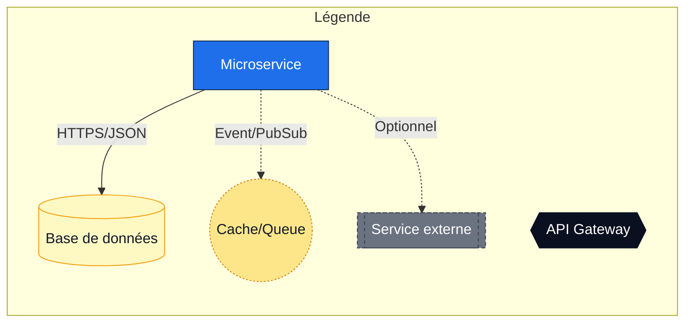

##Test

```mermaid
flowchart LR
  subgraph Légende
    MS[Microservice]:::core
    GW{{API Gateway}}:::gateway
    DB[(Base de données)]:::db
    CQ((Cache/Queue)):::cache
    EXT[[Service externe]]:::external
  end

  MS -->|HTTPS/JSON| DB
  MS .->|Event/PubSub| CQ
  MS -.->|Optionnel| EXT

  classDef core fill:#1f6feb,stroke:#0f2d57,color:#fff;
  classDef v11 fill:#1a7f37,stroke:#0e4d22,color:#fff;
  classDef v12 fill:#a15600,stroke:#5a2f00,color:#fff;
  classDef v20 fill:#6e40c9,stroke:#3d2280,color:#fff;
  classDef external fill:#6b7280,stroke:#374151,color:#fff,stroke-dasharray: 4 3;
  classDef db fill:#fef9c3,stroke:#f59e0b,color:#111827;
  classDef cache fill:#fde68a,stroke:#d97706,color:#111827,stroke-dasharray: 2 2;
  classDef gateway fill:#0b1020,stroke:#0b1020,color:#fff;

```
