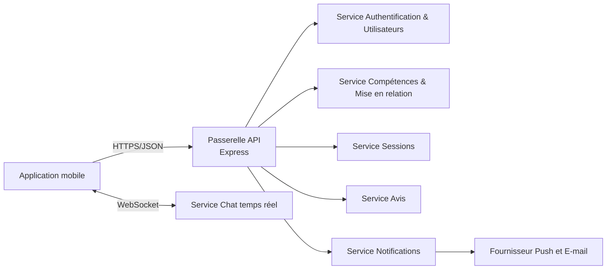
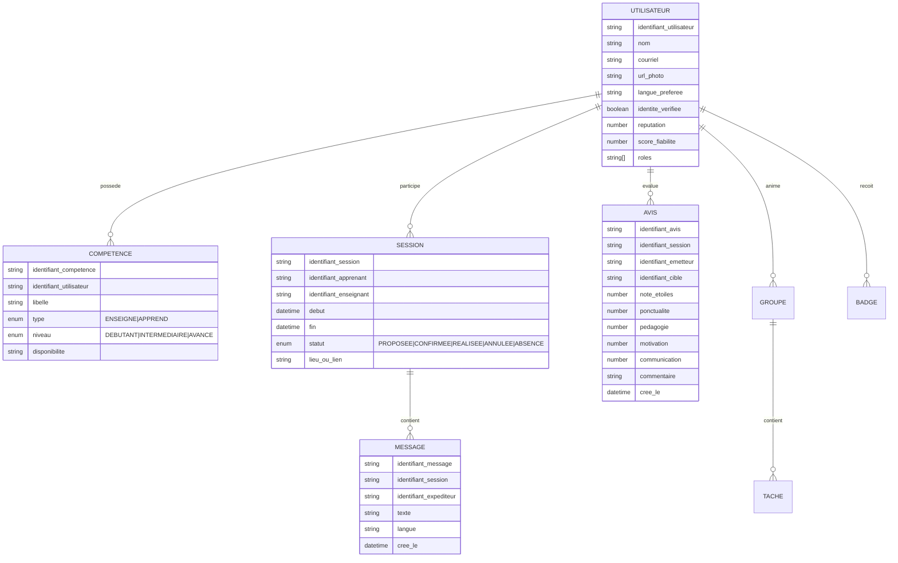
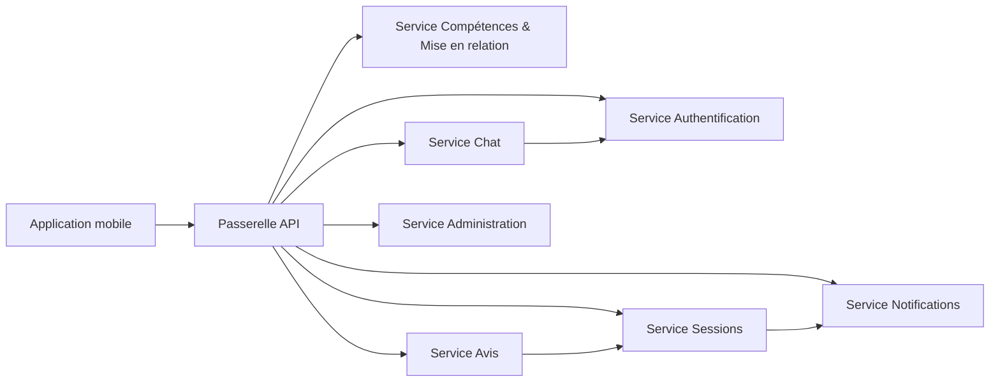
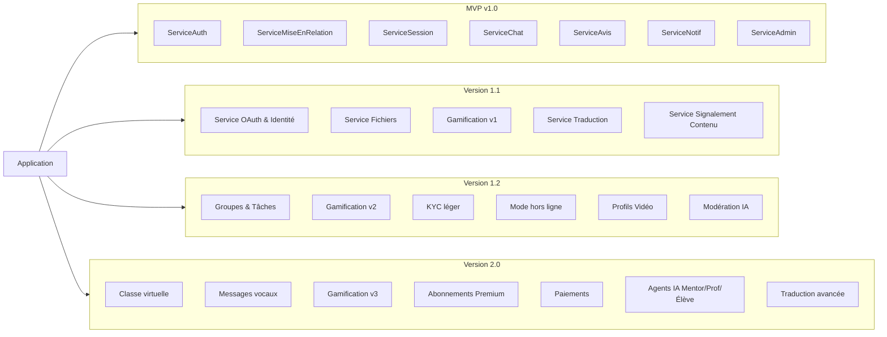
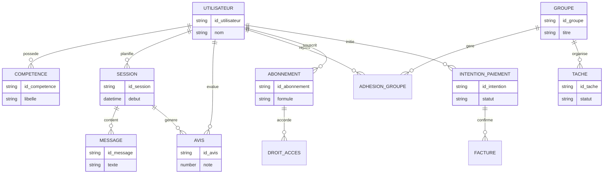
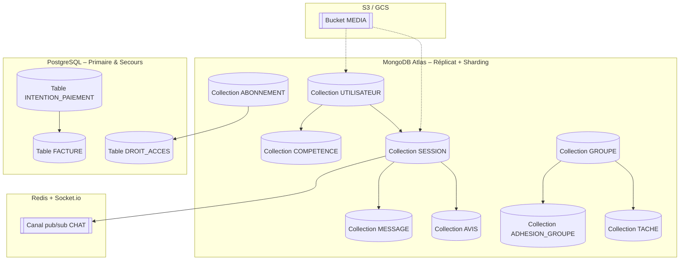
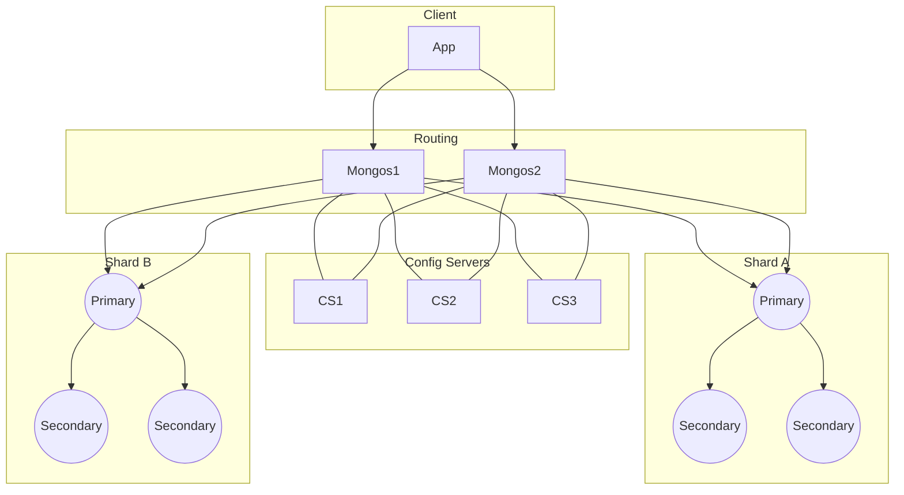
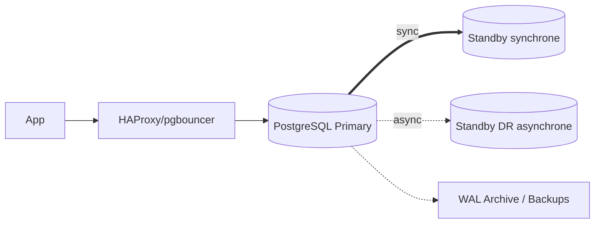
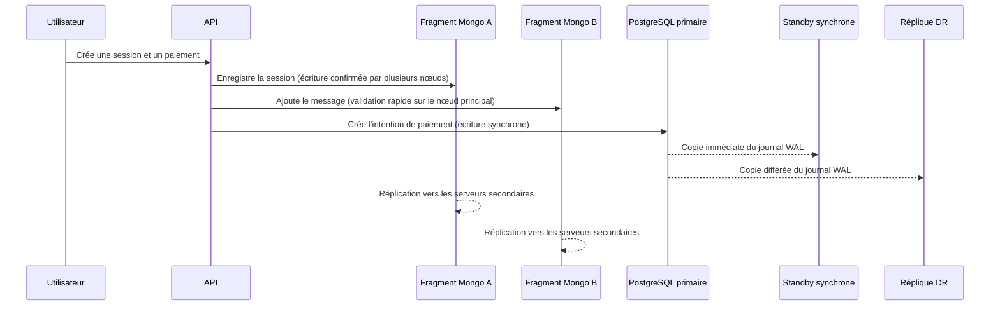

# SwapSkill

Document de synthèse couvrant la conception applicative (TP1), l’architecture microservices (TP2) et la conception du cluster de bases de données (TP3) pour l’application mobile sociale d’échange de compétences **SkillSwap**.

---

## Phase 1 – Application Conception (TP1)

### 1. Vision & Positionnement

- **Nom :** SkillSwap  
- **Type :** Application mobile sociale pair-à-pair (React Native)  
- **Domaine :** Échange de compétences, apprentissage communautaire et accompagnement par IA  
- **Purpose :** Mettre en relation des personnes qui veulent enseigner ou apprendre des compétences avec une expérience fiable, motivante et accessible.

### 2. Objectifs & Problèmes adressés

- démocratiser l’apprentissage en réduisant les coûts et en offrant des formats flexibles ;
- assurer un cadre de collaboration clair et motivant (mise en relation, objectifs, rappels) ;
- instaurer la confiance via vérifications, évaluations et modération ;
- centraliser l’expérience (profil, chat, sessions, feedback) sur une plateforme moderne.

### 3. Fonctionnalités principales (MVP)

- **Profils & compétences :** bio, photo, localisation approximative, compétences “J’enseigne/J’apprends”, disponibilité, langues, mini-vidéo (≤30 s), certificats vérifiés.  
- **Mise en relation :** recommandations par proximité, filtres (langue, niveau, présentiel/distanciel), score de réputation.  
- **Messagerie & sessions :** chat 1-1 temps réel, partage de fichiers légers, propositions/confirmations de sessions, rappels automatiques.  
- **Évaluations & confiance :** notation multi-critères, signalement, blocage, modération.  
- **Notifications :** push & email pour conversations, sessions et rappels.  
- **Sécurité :** auth email/mot de passe, vérification email, JWT, Helmet, CORS, RGPD (consentement, export/suppression compte).

### 4. Diagrammes des interactions

#### Diagramme – Flux applicatif MVP



#### Diagramme – Modèle de données conceptuel (extrait)



### 5. Processus de création

#### Conception

- ateliers personas (apprenant, enseignant, mentor, admin) ;
- **Rôle du mentor (persona humaine)** : profil expert qui accompagne les apprenants sur la durée, propose des plans d’apprentissage personnalisés, garantit la qualité des sessions et renforce la confiance dans l’écosystème.
- parcours utilisateurs complets (inscription → mise en relation → chat → session → retour d’expérience) ;
- wireframes Figma (maquettes interactives) pour profil, mise en relation, chat, planification, groupe, statistiques ;
- séances de co-conception sur FigJam (tableau blanc collaboratif) pour aligner l’équipe ;
- exigences d’accessibilité (contraste, navigation, textes alternatifs) et d’internationalisation FR/EN.

#### Développement

- **Frontend :** React Native et Expo (ensemble qui permet de créer rapidement des applications mobiles avec JavaScript), TypeScript (ajoute du typage pour réduire les erreurs), React Query (met en cache les données distantes) et AsyncStorage (petit espace de stockage local pour le mode hors connexion).
- **Backend :** Node.js (exécution de JavaScript côté serveur), Express (cadre minimal pour produire des API), Socket.io (canal temps réel) et Mongoose (accès simplifié à MongoDB).
- **Notifications :** Expo Notifications (service push proposé par Expo), Resend et Mailgun (envoi d’e-mails transactionnels).
- **Sécurité :** JWT (jetons d’authentification), bcrypt (hachage des mots de passe), Zod et Yup (validation des données), Helmet (renforce les en-têtes de sécurité), CORS (autorise seulement les domaines approuvés) et rate limiting (limite le nombre de requêtes pour freiner les abus).
- **Observabilité :** pino (journalisation rapide et lisible) et Prometheus (collecte des métriques exposées par les services).

#### Test

- Tests unitaires (vérifient chaque partie de code isolément : authentification, mise en relation, notifications, scoring).
- Tests d’intégration (s’assurent que les API REST, WebSocket et l’upload fonctionnent bien ensemble).
- Tests E2E avec Detox (outil qui rejoue automatiquement tout le parcours utilisateur pour garantir que l’application marche de bout en bout).
- Tests de performance (mesurent l’impact d’une forte charge sur le chat, les notifications et la mise en relation).
- Tests de sécurité (contrôlent les failles XSS, injections, abus de signalement, double authentification et respect du RGPD).

#### Déploiement

- Backend emballé dans des conteneurs Docker et déployé sur Railway ou Render (plateformes cloud simples pour lancer un service), automatisé par des pipelines CI/CD GitHub Actions (exécutions automatiques des tests et déploiements).
- MongoDB Atlas (hébergement géré de MongoDB avec sauvegardes automatiques et filtrage d’adresses IP).
- Expo EAS Build & Update (service Expo qui compile l’application React Native et permet d’expédier des mises à jour sans repasser par les stores).
- Configuration des secrets (données sensibles chiffrées dans Vault ou GitHub Secrets) et runbooks de déploiement (fiches pas-à-pas qui expliquent comment lancer ou restaurer un déploiement en toute sécurité).

#### Maintenance

- Backlog produit et feuilles de route versionnées (liste ordonnée des évolutions avec priorités).
- Suivi des retours via GitHub Issues/Projects (tickets centralisés pour les demandes et corrections).
- Politique SemVer (numérotation version majeure.mineure.correctif) et changelog (journal public qui explique chaque changement).
- Nettoyage régulier des sessions/messages obsolètes, mise à jour des index et surveillance.

### 6. Acteurs & Parties prenantes

- **Acteurs internes :** dev mobile, dev backend, data/IA, QA, DevOps, modération/support ;
- **Utilisateurs clés :** apprenant, enseignant, mode mixte (teach/learn), admin groupe, admin plateforme ;
- **Parties prenantes :** communautés locales, associations, établissements éducatifs, partenaires cloud & IA, stores mobiles.

### 7. Outils & Protocoles

- **Gestion :** approche Agile/Scrum léger (organisation par cycles courts), sprints de 2 semaines (cadre temporel fixe) et GitHub Projects (tableau visuel pour suivre les tâches).
- **Design :** Figma (outil de maquette d’interfaces), FigJam (tableau blanc collaboratif pour brainstormer et concevoir) et Mermaid (langage texte qui génère automatiquement des diagrammes).
- **Stack technique :** React Native avec Expo (ensemble pour créer et lancer des apps mobiles), TypeScript (JavaScript avec typage pour éviter les erreurs), Node.js avec Express (serveur web simple), Socket.io (canal temps réel), MongoDB (base de données orientée documents), PostgreSQL pour les paiements (base relationnelle fiable) et stockage d’objets S3/GCS (dépôt de fichiers).

- **Qualité :** ESLint (vérifie le style de code), Prettier (formate automatiquement), Jest (tests unitaires), React Testing Library (tests d’interface), Supertest (tests des API) et Detox (tests mobiles automatisés fin à fin).
- **Sécurité :** HTTPS (chiffre le trafic), JWT (jetons d’authentification), Helmet (protection des en-têtes), RBAC (rôles utilisateurs), chiffrement au repos via KMS (clés gérées) et respect du RGPD (protection des données personnelles).
- **CI/CD :** GitHub Actions (automatisation des builds), Docker (conteneurs portables), Sentry (suivi des erreurs), Prometheus (collecte de métriques) et Grafana (tableaux de bord pour visualiser ces métriques).

---

## Phase 2 – Application Architecture (TP2)

### 1. Microservices identifiés

| Microservice | Responsabilités clés | Consommateurs principaux |
| --- | --- | --- |
| Auth & Users | Auth email/mot de passe + OAuth, profils, rôles, réputation | Tout le système |
| Compétences & Mise en relation | Gestion des compétences et rapprochement par règles/filtres | Application mobile, Sessions |
| Sessions | Création/proposition/confirmation sessions, rappels | Mobile app, Notifications |
| Service Chat | Messagerie temps réel (texte, fichiers, audio v2), traduction | Application mobile |
| Service Avis | Collecte avis multi-critères, agrégation réputation | Application mobile, Administration |
| Service Notifications | Envoi push/email, rappels, relances | Sessions, Administration |
| Administration & Modération | Signalements, bannissement, audit logs | Support, Administration |
| Service Fichiers | Métadonnées certificats, vidéos profil, pièces jointes | Authentification, Chat, Groupes |
| Groupes & Tâches (v1.2) | Groupes, forums, tâches, échéances | Application mobile |
| Gamification (v1.0→v3) | Points, badges, classements, fiabilité | Backend, Application mobile |
| Services IA | Mentor/Prof/Étudiant, traduction avancée, modération IA | Chat, Sessions, Administration |
| Paiements & Abonnements | Abonnements Premium/VIP, facturation | Application mobile, Administration |
| Classe virtuelle | Visioconférence, tableau blanc, salles de sous-groupes | Sessions, Groupes |

**Rôle du Mentor (services IA)** : l’agent Mentor propose des parcours d’apprentissage guidés, synthétise les progrès des apprenants et suggère des activités adaptées. Il existe pour prolonger l’accompagnement humain, fluidifier la préparation des sessions et maintenir la motivation dans la durée.

### 2. Interactions & évolution

#### Diagramme – Architecture MVP (v1.0)



#### Diagramme – Vue d’ensemble des évolutions (v1.0 → v2.0)



### 3. Bases de données par service et justification

| Microservice | Base choisie | Justification |
| --- | --- | --- |
| Authentification & Utilisateurs | MongoDB (réplicat) | Schémas évolutifs pour stocker profils et préférences, email indexé de façon unique |
| Compétences & Mise en relation | MongoDB puis Elasticsearch | MongoDB pour les opérations simples, Elasticsearch pour les recherches rapides avec filtres |
| Sessions | MongoDB | Documents souples pour dates, participants et statuts, avec index temporels |
| Service Chat | MongoDB + Redis | MongoDB conserve l’historique, Redis gère l’échange instantané |
| Service Avis | MongoDB | Calculer la réputation et garder un historique flexible |
| Service Notifications | MongoDB (journal) + Expo/Firebase | Traçabilité locale et envoi via des fournisseurs push spécialisés |
| Service Fichiers | S3/GCS + MongoDB | Fichiers lourds dans S3/GCS, métadonnées dans MongoDB |
| Groupes & Tâches | MongoDB | Structure souple pour forums, rôles et tâches |
| Gamification | MongoDB | Scores et badges stockés sous forme d’événements flexibles |
| Services IA | MongoDB + APIs externes | Enregistrer les requêtes IA et utiliser des services spécialisés |
| Paiements | PostgreSQL | Transactions financières cohérentes et contraintes fortes |

### 4. Modélisation des données par microservice

- **Authentification & Utilisateurs :** collection `UTILISATEUR` avec un identifiant, un courriel unique, la langue préférée, les rôles, la réputation et le score de fiabilité ; tables liées `LIEN_IDENTITE` et `VERIF_TELEPHONE` pour stocker les liaisons OAuth et numéros vérifiés.
- **Compétences & Mise en relation :** collection `COMPETENCE` rattachée à chaque utilisateur avec libellé, type (enseigne/apprend), niveau et disponibilité ; index texte sur le libellé et filtres sur type/niveau/langues.
- **Sessions :** collection `SESSION` qui relie apprenant et enseignant, stocke la période, le mode (présentiel/distanciel) et le statut, avec index temporels et un point géographique pour la recherche par proximité.
- **Chat :** collection `MESSAGE` liée aux sessions avec contenu texte, langue, pièces jointes ou audio ; index chronologique pour paginer rapidement l’historique.
- **Avis :** collection `AVIS` avec une contrainte d’un avis par session et par émetteur, notes détaillées (ponctualité, pédagogie, motivation, communication) et index sur la personne évaluée.
- **Notifications :** collection `JOURNAL_NOTIFICATION` qui conserve les envois et leur statut avec une durée de vie limitée afin de pouvoir rejouer en cas d’échec.
- **Groupes & Tâches :** collections `GROUPE`, `ADHESION_GROUPE` et `TACHE` pour gérer rôles, membres et échéances ; index composés pour trier rapidement par groupe et statut.
- **Gamification :** collections `EVENEMENT_ACTIVITE`, `CLASSEMENT`, `BADGE`, `UTILISATEUR_BADGE` et `STATISTIQUE_UTILISATEUR` pour suivre points, badges et classements par période.
- **Service Fichiers :** collection `MEDIA` qui stocke les métadonnées des images, vidéos ou documents avec résultats d’analyse antivirus et durées.
- **Services IA :** collections `SESSION_IA`, `MESSAGE_IA`, `AVIS_IA` et `ALERTE_MODERATION` pour tracer les échanges avec les assistants et la modération automatique.
- **Paiements & Abonnements (PostgreSQL) :** tables `INTENTION_PAIEMENT`, `FACTURE`, `ABONNEMENT` et `DROIT_ACCES` pour suivre les flux financiers, avec index sur l’utilisateur et le statut.

### 5. Architecture report (synthèse)

- **Gateway unique** pour contrôler l’accès et centraliser l’authentification JWT.  
- **Communication** majoritairement REST ; WebSocket (Socket.io) pour chat et notifications en quasi temps réel ; events internes pour gamification.  
- **Scalabilité** via redimensionnement automatique horizontal de chaque microservice et stockage S3/Drive séparé pour les médias lourds.  
- **Résilience** : réessais progressifs côté clients, coupe-circuits applicatifs, file de messages pour les notifications et stockage distribué.  
- **Sécurité** : RBAC, scopes API, validation stricte, chiffrement TLS, secrets managés.  
- **Observabilité** : logs centralisés (pino), traçage (OpenTelemetry), métriques (Prometheus/Grafana), alerting (PagerDuty).  
- **Roadmap** : montée progressive (v1.1/v1.2/v2.0) en ajoutant services spécialisés sans casser les contrats clients.

---

## Modèle de Conception de Données (Conceptual Data Model)

Ce modèle illustre les grandes entités métiers, leurs relations et les flux d’information indispensables pour soutenir les parcours apprenant ↔ enseignant.

##### Diagramme – Vue conceptuelle des entités


## Modèle Logique de Données (Logical Data Model)

La vue logique précise les attributs structurants, les clés et les dépendances qui guideront la construction des schémas dans les bases documentaires et relationnelles.

##### Tableau – Structure logique des principales entités
| Entité | Attributs clés | PK | FK / Relations |
| --- | --- | --- | --- |
| Utilisateur | courriel, langue_préférée, rôles, réputation, score_fiabilité | `id_utilisateur` | Référencé par Compétence, Session, Avis, AdhésionGroupe, Abonnement, IntentionPaiement |
| Compétence | libellé, type, niveau, disponibilité | `id_compétence` | `id_utilisateur → Utilisateur` |
| Session | id_apprenant, id_enseignant, début, fin, statut, lieu_ou_lien | `id_session` | `id_apprenant → Utilisateur`, `id_enseignant → Utilisateur` |
| Message | id_session, id_expediteur, texte, langue, créé_le | `id_message` | `id_session → Session`, `id_expediteur → Utilisateur` |
| Avis | id_session, id_emetteur, id_cible, note_etoiles, critères | `id_avis` | `id_session → Session`, `id_emetteur → Utilisateur`, `id_cible → Utilisateur` |
| Groupe | id_admin, titre, visibilité | `id_groupe` | `id_admin → Utilisateur` |
| AdhésionGroupe | id_groupe, id_utilisateur, rôle, rejoint_le | `id_adhesion` | `id_groupe → Groupe`, `id_utilisateur → Utilisateur` |
| Tâche | id_groupe, titre, statut, échéance | `id_tache` | `id_groupe → Groupe` |
| Abonnement | id_utilisateur, formule, statut, début, fin | `id_abonnement` | `id_utilisateur → Utilisateur` |
| IntentionPaiement | id_utilisateur, montant, devise, statut, créé_le | `id_intention_paiement` | `id_utilisateur → Utilisateur` |

##### Diagramme – Vue logique des entités et dépendances
```mermaid
erDiagram
	UTILISATEUR {
		string id_utilisateur PK
		string courriel UNIQUE
		string langue_preferee
		string[] roles
		number reputation
		number score_fiabilite
	},

	COMPETENCE {
		string id_competence PK
		string id_utilisateur FK
		string libelle
		enum type "ENSEIGNE|APPREND"
		enum niveau "DEBUTANT|INTERMEDIAIRE|AVANCE"
		string disponibilite
	},

	SESSION {
		string id_session PK
		string id_apprenant FK
		string id_enseignant FK
		datetime debut
		datetime fin
		enum statut "PROPOSEE|CONFIRMEE|REALISEE|ANNULEE|ABSENCE"
		string lieu_ou_lien
	}

	MESSAGE {
		string id_message PK
		string id_session FK
		string id_expediteur FK
		string texte
		string langue
		datetime cree_le
	}

	AVIS {
		string id_avis PK
		string id_session FK
		string id_emetteur FK
		string id_cible FK
		number note_etoiles
		number ponctualite
		number pedagogie
		number motivation
		number communication
		string commentaire
	}

	GROUPE {
		string id_groupe PK
		string titre
		string visibilite
	}

	ADHESION_GROUPE {
		string id_adhesion PK
		string id_groupe FK
		string id_utilisateur FK
		string role
		datetime rejoint_le
	}

	TACHE {
		string id_tache PK
		string id_groupe FK
		string titre
		string statut
		datetime echeance
	}

	ABONNEMENT {
		string id_abonnement PK
		string id_utilisateur FK
		string formule
		enum statut "ACTIF|EN_ATTENTE|SUSPENDU|EXPIRE"
		datetime debut
		datetime fin
	}

	INTENTION_PAIEMENT {
		string id_intention_paiement PK
		string id_utilisateur FK
		number montant
		string devise
		enum statut "INITIEE|CONFIRMEE|ANNULEE|EXPIREE"
		datetime cree_le
	}

	FACTURE {
		string id_facture PK
		string id_intention_paiement FK
		string reference_externe
		number montant
		enum statut "EN_ATTENTE|PAYEE|REMBOURSEE"
		datetime emise_le
	}

	UTILISATEUR ||--o{ COMPETENCE : possede
	UTILISATEUR ||--o{ SESSION : participe
	UTILISATEUR ||--o{ AVIS : evalue
	UTILISATEUR ||--o{ ADHESION_GROUPE : rejoint
	UTILISATEUR ||--o{ ABONNEMENT : souscrit
	UTILISATEUR ||--o{ INTENTION_PAIEMENT : initie
	SESSION ||--o{ MESSAGE : contient
	SESSION ||--o{ AVIS : genere
	GROUPE ||--o{ ADHESION_GROUPE : gere
	GROUPE ||--o{ TACHE : planifie
	ABONNEMENT ||--o{ FACTURE : justifie
	INTENTION_PAIEMENT ||--o{ FACTURE : produit
```

## Modèle Physique de Données (Physical Data Model)

La représentation physique détaille où et comment chaque entité est stockée, ainsi que les index optimisant les opérations critiques.

##### Tableau – Implémentation physique
| Entité / Collection | Technologie | Index principaux | Notes |
| --- | --- | --- | --- |
| Utilisateur, Compétence, Session, Message, Avis | MongoDB (réplicat + sharding) | `courriel`, `(id_session, cree_le)`, `(id_cible, cree_le)` | Données temps réel avec schéma souple |
| Groupe, AdhésionGroupe, Tâche | MongoDB | `(id_groupe, id_utilisateur)`, `(id_groupe, statut, echeance)` | Organisation des groupes et forums |
| Abonnement, DroitAcces | MongoDB | `(id_utilisateur, statut)` | Activation rapide des options Premium |
| IntentionPaiement, Facture | PostgreSQL (primaire + secours) | `id_utilisateur`, `statut` | Transactions financières cohérentes |

##### Diagramme – Répartition physique et stockage

| JournalNotification | MongoDB | `(id_utilisateur, envoye_le)` + TTL | Traçabilité et purge automatique |
| Média | S3 + métadonnées MongoDB | `(id_utilisateur, cree_le)` | Stockage des fichiers volumineux |

---

## Glossaire des technologies et méthodes

- **React Native :** framework mobile basé sur JavaScript qui permet de créer la même application pour iOS et Android.  
- **Expo :** environnement clé en main qui simplifie le lancement, le test et la publication d’une application React Native.  
- **Expo EAS Build & Update :** service en ligne qui compile l’application et envoie des mises à jour immédiates aux utilisateurs.  
- **TypeScript :** version de JavaScript avec typage qui aide à éviter les erreurs courantes.  
- **React Query :** bibliothèque qui gère la récupération et la mise en cache des données distantes côté client.  
- **AsyncStorage :** petit espace de stockage local dans l’application mobile pour conserver des brouillons hors connexion.  
- **Node.js :** plateforme qui exécute du JavaScript côté serveur.  
- **Express :** micro-framework qui facilite la création d’API web avec Node.js.  
- **Socket.io :** bibliothèque qui ouvre un canal temps réel (WebSocket) entre client et serveur.  
- **WebSocket :** protocole qui maintient une connexion ouverte pour échanger des messages instantanés.  
- **Mongoose :** couche d’accès qui simplifie les requêtes MongoDB avec des modèles.  
- **MongoDB :** base de données orientée documents, souple et adaptée aux données évolutives.  
- **MongoDB Atlas :** version cloud managée de MongoDB avec sauvegardes et supervision.  
- **Sharding MongoDB :** découpe les données en plusieurs fragments pour répartir la charge.  
- **Replica set MongoDB :** groupe de serveurs qui stockent la même donnée pour assurer la haute disponibilité.  
- **Redis :** base en mémoire très rapide, pratique pour la messagerie en temps réel.  
- **Elasticsearch :** moteur de recherche texte qui offre des filtres puissants et rapides.  
- **PostgreSQL :** base de données relationnelle fiable, idéale pour les transactions financières.  
- **Disaster Recovery (DR) :** plan qui garantit une copie distante des données en cas de catastrophe.  
- **Standby synchrone :** réplique qui confirme chaque écriture avant validation afin d’éviter toute perte.  
- **Patroni :** outil qui surveille plusieurs serveurs PostgreSQL et choisit automatiquement le chef en cas de panne.  
- **WAL (Write-Ahead Log) :** journal des changements PostgreSQL qui permet de rejouer les écritures.  
- **PITR (Point In Time Recovery) :** restauration de la base à un instant donné grâce aux journaux WAL.  
- **HAProxy / pgbouncer :** proxys qui équilibrent les connexions vers PostgreSQL et gèrent la bascule.  
- **Railway / Render :** plateformes cloud simples qui hébergent automatiquement les services Dockerisés.  
- **Docker :** conteneur qui embarque tout le code et ses dépendances pour tourner partout.  
- **CI/CD (GitHub Actions) :** automatisation des tests et déploiements à chaque changement de code.  
- **Expo Notifications :** service d’Expo qui envoie des notifications push sur mobile.  
- **Resend / Mailgun :** services d’envoi d’e-mails transactionnels fiables.  
- **JWT (JSON Web Token) :** jeton signé qui prouve l’identité d’un utilisateur.  
- **bcrypt :** algorithme qui chiffre les mots de passe avant stockage.  
- **Zod / Yup :** bibliothèques qui vérifient la forme des données reçues.  
- **Helmet :** middleware qui renforce les en-têtes de sécurité HTTP.  
- **CORS :** mécanisme qui autorise l’accès aux API uniquement depuis des domaines approuvés.  
- **Rate limiting :** limite le nombre de requêtes pour protéger l’API contre les abus.  
- **RBAC (Role-Based Access Control) :** gestion des autorisations en fonction du rôle de l’utilisateur.  
- **KMS (Key Management Service) :** service qui stocke et protège les clés de chiffrement.  
- **RGPD :** règlement européen qui encadre la protection des données personnelles.  
- **S3 / GCS :** stockages d’objets (Amazon et Google) pour conserver des fichiers volumineux.  
- **pino :** librairie de logs rapide et structurée.  
- **Prometheus :** outil qui collecte les métriques techniques.  
- **Grafana :** tableau de bord qui affiche les métriques Prometheus de façon visuelle.  
- **Sentry :** plateforme qui collecte et alerte sur les erreurs applicatives.  
- **OpenTelemetry :** standard qui unifie la collecte des traces techniques.  
- **PagerDuty :** service qui prévient l’équipe lorsqu’une alerte critique survient.  
- **React Testing Library :** outil qui teste l’interface comme le ferait un utilisateur.  
- **Jest :** framework de tests unitaires pour JavaScript.  
- **Supertest :** bibliothèque qui teste les API HTTP.  
- **Detox :** outil de tests mobiles automatisés qui rejoue un parcours complet.  
- **Figma :** logiciel de design collaboratif pour créer des maquettes.  
- **FigJam :** tableau blanc virtuel pour réfléchir et co-concevoir en équipe.  
- **Mermaid :** langage texte qui transforme rapidement les idées en diagrammes.  
- **Agile / Scrum léger :** méthode de travail en petites itérations régulières.  
- **Sprint :** période courte (ici deux semaines) qui cadre les objectifs de l’équipe.  
- **GitHub Projects :** tableau Kanban pour suivre les tâches.  
- **GitHub Issues :** tickets centralisés pour décrire bugs et évolutions.  
- **Vault / GitHub Secrets :** coffres-forts qui conservent les mots de passe et clés chiffrés.  
- **Runbook :** guide détaillé qui explique comment réaliser une opération (par exemple un déploiement ou une reprise).  
- **Backlog produit :** liste priorisée de toutes les fonctionnalités à développer.  
- **SemVer (Semantic Versioning) :** standard de numérotation en trois chiffres (majeur.mineur.correctif) qui indique la compatibilité.  
- **Changelog :** journal public qui résume les nouveautés de chaque version.  
- **KYC léger :** vérification d’identité simplifiée pour rassurer la communauté.  
- **Gamification :** mécaniques de points et de badges pour encourager la participation.  
- **Mode hors ligne :** permet d’utiliser l’application même sans connexion Internet.  
- **Classe virtuelle :** salle de visioconférence intégrée pour donner cours à distance.  
- **Agents IA Mentor/Prof/Élève :** assistants basés sur l’intelligence artificielle qui conseillent apprenants et enseignants.  
- **Traduction avancée :** service automatique qui traduit le chat en temps réel.  
- **Observabilité :** pratique qui combine logs, métriques et traces pour comprendre le comportement du système.  
- **Plan de reprise après sinistre :** stratégie qui détaille comment redémarrer le service après un incident majeur.  
- **Périmètre RGPD :** ensemble des engagements pris pour respecter la législation européenne sur les données.

---

## Phase 3 – Database Cluster (TP3)

### 1. Tables modélisées, clés et index

| Table / Collection | PK | FK | Index & Contraintes clés |
| --- | --- | --- | --- |
| UTILISATEUR | `id_utilisateur` | – | `courriel UNIQUE`, index sur les rôles |
| COMPETENCE | `id_competence` | `id_utilisateur → UTILISATEUR` | `(id_utilisateur)`, `libelle (texte)`, `(type, niveau)`, `(langues)` |
| SESSION | `id_session` | `id_apprenant`, `id_enseignant`, `cree_par → UTILISATEUR` | `(id_apprenant, id_enseignant, debut)`, `(statut, debut)`, index géo sur `point_lieu` |
| MESSAGE | `id_message` | `id_session → SESSION`, `id_expediteur → UTILISATEUR` | `(id_session, cree_le)`, `(id_expediteur, cree_le)` |
| AVIS | `id_avis` | `id_session`, `id_emetteur`, `id_cible → UTILISATEUR` | `UNIQUE(id_session, id_emetteur)`, `(id_cible, cree_le DESC)` |
| GROUPE | `id_groupe` | `id_admin → UTILISATEUR` | `(id_admin)`, `(cree_le DESC)` |
| ADHESION_GROUPE | `id_adhesion` | `id_groupe → GROUPE`, `id_utilisateur → UTILISATEUR` | `UNIQUE(id_groupe, id_utilisateur)` |
| TACHE | `id_tache` | `id_groupe → GROUPE` | `(id_groupe, statut, echeance)` |
| BADGE | `id_badge` | – | `code UNIQUE` |
| UTILISATEUR_BADGE | `id_utilisateur_badge` | `id_utilisateur → UTILISATEUR`, `id_badge → BADGE` | `UNIQUE(id_utilisateur, id_badge)` |
| STATISTIQUE_UTILISATEUR | `id_utilisateur` | `id_utilisateur → UTILISATEUR` | – |
| LIEN_IDENTITE | `id_lien_identite` | `id_utilisateur → UTILISATEUR` | `UNIQUE(fournisseur, identifiant_fournisseur)` |
| VERIF_TELEPHONE | `id_verif_telephone` | `id_utilisateur → UTILISATEUR` | `UNIQUE(numero)` |
| MEDIA | `id_media` | `id_utilisateur → UTILISATEUR` | `(id_utilisateur, cree_le DESC)`, `(type, cree_le DESC)` |
| SIGNALEMENT | `id_signalement` | `id_auteur`, `id_cible → UTILISATEUR` | `(statut, cree_le DESC)`, `(id_cible)` |
| CLASSEMENT | `id_classement` | `id_utilisateur → UTILISATEUR` | `UNIQUE(id_utilisateur, periode, role)`, `(periode, role, score DESC)` |
| JOURNAL_NOTIFICATION | `id_notification` | `id_utilisateur → UTILISATEUR` | `(id_utilisateur, envoye_le DESC)`, TTL |
| INTENTION_PAIEMENT (SQL) | `id` | `id_utilisateur → UTILISATEUR` | `(id_utilisateur, statut)` |
| ABONNEMENT (SQL) | `id` | `id_utilisateur → UTILISATEUR` | `(id_utilisateur, statut)`, `(formule, statut)` |

### 2. Normalisation & intégrité

- **1NF** : données atomiques, listes externalisées (`GROUP_MEMBERSHIP`, `USER_BADGE`).  
- **2NF** : aucune dépendance partielle (PK techniques).  
- **3NF** : dépendances fonctionnelles isolées (badges, stats, identité).  
- **Intégrité référentielle** assurée via FK logiques (MongoDB) ou réelles (PostgreSQL).  
- **Gestion fichiers lourds** via stockage objet ; métadonnées uniquement en base.

### 3. Étude & choix de réplication

| Technique | Avantages | Limites | Usage SwapSkill |
| --- | --- | --- | --- |
| Synchrone | Cohérence forte (RPO≈0) | Latence élevée, dépend réseau | Paiements PostgreSQL (transactions critiques) |
| Asynchrone | Faible latence, haute capacité | RPO>0 (données récentes perdues) | Chat, profils, mise en relation (MongoDB) |
| Semi-synchrone | Compromis cohérence/latence | Complexité, besoin quorum | Sessions sensibles (write concern majority) |
| Multi-leader | Écritures locales multi-régions | Conflits possibles | Non retenu (conflits trop élevés) |

**Décision :** cohérence différenciée → MongoDB en réplication asynchrone (write concern adapté par collection) + PostgreSQL en réplication synchrone locale + DR asynchrone.

### 4. Configuration des clusters

#### Domaine social MongoDB — Actif–Actif (sharding + replica sets)

- shards par segment fonctionnel (ex : `users+skills`, `sessions+messages`) ;  
- chaque shard = replica set (primary + 2 secondary + arbiter optionnel) ;  
- `mongos` redondants, 3 config servers ;  
- write concerns différenciés : `w:1` (messages), `w:"majority", j:true` (sessions/reviews) ;  
- read preference `primary` temps réel, `secondary` pour reporting.

##### Diagramme – Topologie MongoDB en mode actif–actif


#### Paiements PostgreSQL — Actif–Passif (primaire + standby synchrone + DR)

- primaire et standby synchrone dans des AZ distinctes (`synchronous_commit=on`, `synchronous_standby_names='1 (pgsync1)'`) ;  
- standby DR asynchrone (autre région) + WAL archiving S3 pour PITR ;  
- bascule orchestrée via HAProxy/pgbouncer + Patroni ;  
- monitoring du `replication_lag`, tests de failover trimestriels.

**Comprendre les rôles du cluster PostgreSQL :**
- **Primary** : nœud principal qui accepte les écritures et sert de référence pour l’état des données.
- **Standby synchrone** : réplique située dans une zone de disponibilité différente ; elle confirme chaque écriture avant validation, ce qui garantit un RPO≈0 en cas de bascule.
- **Disaster Recovery (DR)** : réplique distante asynchrone conservée pour les incidents majeurs (perte de région). Elle peut être promue manuellement et se resynchronise via les journaux WAL archivés.
Ces trois rôles fonctionnent ensemble : le primary sert le trafic normal, le standby synchrone prend le relais automatiquement si le primary devient indisponible, tandis que le nœud de DR assure une copie de secours à froid pour restaurer le service même en cas de catastrophe géographique.

##### Diagramme – Topologie PostgreSQL en mode actif–passif


### 5. Haute disponibilité & gestion des pannes

- **MongoDB :** élections automatiques <15 s, reroutage `mongos`, réplication cross-AZ, sharding limitant l’impact à un shard ; tests de bascule réguliers.  
- **PostgreSQL :** Patroni (outil qui surveille et promeut automatiquement la réplique synchrone), RPO≈0 local (aucune perte de données car chaque écriture est confirmée des deux côtés), plan DR régional (copie de secours dans une autre région), runbooks de bascule (checklists pour changer de serveur sans stress) et procédures PITR (restauration à un instant précis grâce aux journaux).  
- **Backups :** snapshots quotidiens + PITR (MongoDB Ops Manager/Atlas, WAL PostgreSQL).  
- **Monitoring :** alertes sur latence, replication lag, élections, erreurs WAL, saturation storage.  
- **Security/Compliance :** chiffrement au repos (KMS), audits, rotation clés, tests DR.

### 6. Rapport technique (résumé)

- rationale du choix asynchrone vs synchrone selon sensibilité ;  
- plan de scalabilité (shards additionnels, partitions PostgreSQL si nécessaire) ;  
- runbooks incident (perte primary, shard offline, latence, corruption) ;  
- SLA : MongoDB RPO≤5 min/RTO≤10 min, PostgreSQL RPO≈0/RTO≤2 min ;  
- budgets monitoring & coût (shards modulaires, standby minimal, DR cold-ready).

### 7. Schémas de distribution & reprise

##### Diagramme – Chaîne d’écriture et de réplication


---
