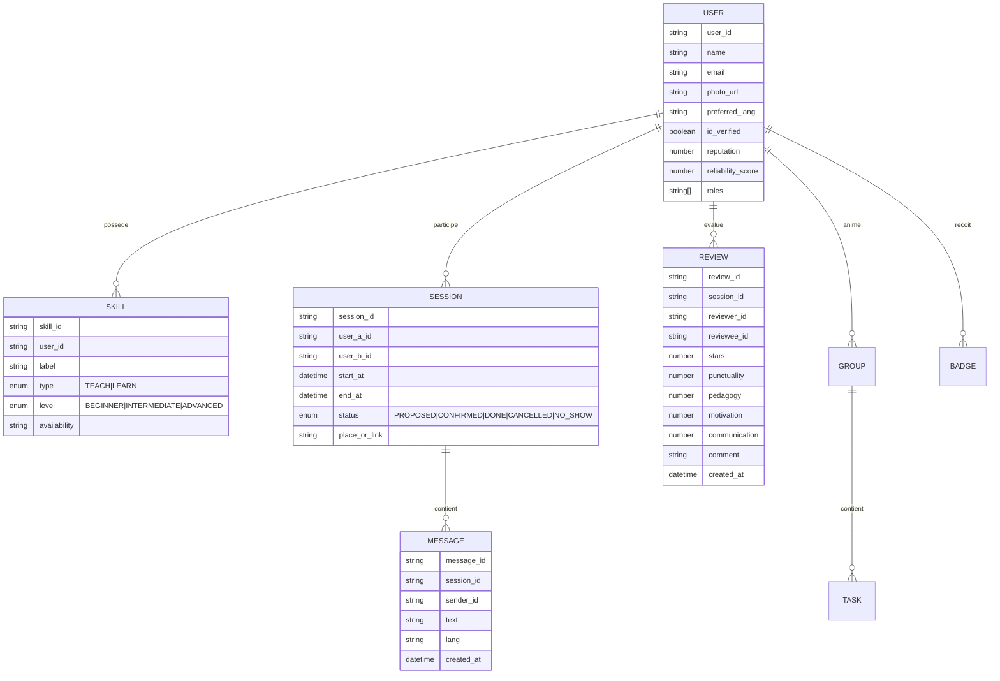

# SwapSkill

Document de synthèse couvrant la conception applicative (TP1), l’architecture microservices (TP2) et la conception du cluster de bases de données (TP3) pour l’application mobile sociale d’échange de compétences **SkillSwap**.

---

## Phase 1 – Application Conception (TP1)

### 1. Vision & Positionnement

- **Nom :** SkillSwap  
- **Type :** Application mobile sociale pair-à-pair (React Native)  
- **Domaine :** Échange de compétences, apprentissage communautaire et accompagnement par IA  
- **Purpose :** Mettre en relation des personnes qui veulent enseigner ou apprendre des compétences avec une expérience fiable, motivante et accessible.

### 2. Objectifs & Problèmes adressés

- démocratiser l’apprentissage en réduisant les coûts et en offrant des formats flexibles ;
- assurer un cadre de collaboration clair et motivant (matching, objectifs, rappels) ;
- instaurer la confiance via vérifications, évaluations et modération ;
- centraliser l’expérience (profil, chat, sessions, feedback) sur une plateforme moderne.

### 3. Fonctionnalités principales (MVP)

- **Profils & compétences :** bio, photo, localisation approximative, compétences “J’enseigne/J’apprends”, disponibilité, langues, mini-vidéo (≤30 s), certificats vérifiés.  
- **Matching :** recommandations par proximité, filtres (langue, niveau, présentiel/distanciel), score de réputation.  
- **Messagerie & sessions :** chat 1-1 temps réel, partage de fichiers légers, propositions/confirmations de sessions, rappels automatiques.  
- **Évaluations & confiance :** notation multi-critères, signalement, blocage, modération.  
- **Notifications :** push & email pour conversations, sessions et rappels.  
- **Sécurité :** auth email/mot de passe, vérification email, JWT, Helmet, CORS, RGPD (consentement, export/suppression compte).

### 4. Diagrammes des interactions

#### Diagramme – Flux applicatif MVP

#### Diagramme – Modèle de données conceptuel (extrait)

### 5. Processus de création

#### Conception

- ateliers personas (apprenant, enseignant, mentor, admin) ;
- **Rôle du mentor (persona humaine)** : profil expert qui accompagne les apprenants sur la durée, propose des plans d’apprentissage personnalisés, garantit la qualité des sessions et renforce la confiance dans l’écosystème.
- parcours utilisateurs complets (onboarding → matching → chat → session → feedback) ;
- wireframes Figma pour profil, matching, chat, planification, groupe, statistiques ;
- exigences d’accessibilité (contraste, navigation, textes alternatifs) et d’internationalisation FR/EN.

#### Développement

- **Frontend :** React Native (Expo), TypeScript, React Query, AsyncStorage pour le mode hors-ligne léger ;
- **Backend :** Node.js, Express, Socket.io, Mongoose (MongoDB) ;
- **Notifications :** Expo Notifications + service mail (Resend/Mailgun) ;
- **Sécurité :** JWT, bcrypt, Zod/Yup pour validation, Helmet, CORS, rate limiting ;
- **Observabilité :** logs pino, métriques Prometheus (extension v1.2+).

#### Test

- unitaires (auth, matching, notifications, scoring) ;
- intégration (REST, WebSocket, upload fichiers) ;
- E2E Detox (parcours complet) ;
- performances (charge chat + notifications + matching) ;
- sécurité (XSS, injection, abus de signalement, 2FA, RGPD).

#### Déploiement

- Backend Dockerisé (Railway/Render), pipelines CI/CD GitHub Actions ;
- MongoDB Atlas (backup automatisé, IP allowlist, M10+) ;
- Expo EAS Build & Update ;
- config de secrets (Vault/GitHub Secrets), runbooks déploiement.

#### Maintenance

- backlog produit & roadmaps versionnées ;
- suivi retours via GitHub Issues/Projects ;
- politique semver + changelog ;
- pruning des sessions/messages obsolètes, index review et monitoring.

### 6. Acteurs & Parties prenantes

- **Acteurs internes :** dev mobile, dev backend, data/IA, QA, DevOps, modération/support ;
- **Utilisateurs clés :** apprenant, enseignant, mode mixte (teach/learn), admin groupe, admin plateforme ;
- **Parties prenantes :** communautés locales, associations, établissements éducatifs, partenaires cloud & IA, stores mobiles.

### 7. Outils & Protocoles

- **Gestion :** Agile/Scrum léger, notion de sprint de 2 semaines, GitHub Projects ;
- **Design :** Figma, FigJam, Mermaid ;
- **Stack technique :** React Native (Expo), TypeScript, Node.js/Express, Socket.io, MongoDB, PostgreSQL (paiements), S3/GCS ;

- **Qualité :** ESLint, Prettier, Jest, React Testing Library, Supertest, Detox ;
- **Sécurité :** HTTPS, JWT, Helmet, RBAC, chiffrement au repos (KMS), RGPD ;
- **CI/CD :** GitHub Actions, Docker, Sentry, Prometheus/Grafana.

---

## Phase 2 – Application Architecture (TP2)

### 1. Microservices identifiés

| Microservice | Responsabilités clés | Consommateurs principaux |
| --- | --- | --- |
| Auth & Users | Auth email/mot de passe + OAuth, profils, rôles, réputation | Tout le système |
| Skills & Matching | Gestion compétences, matching règles/filtres, suggestions | Mobile app, Sessions |
| Sessions | Création/proposition/confirmation sessions, rappels | Mobile app, Notifications |
| Chat | Messagerie temps réel (texte, fichiers, audio v2), traduction | Mobile app |
| Reviews | Collecte avis multi-critères, agrégation réputation | Mobile app, Admin |
| Notifications | Envoi push/email, rappels, relances | Sessions, Admin |
| Admin & Modération | Signalements, bannissement, audit logs | Support, Admin |
| File Storage | Métadonnées certificats, vidéos profil, pièces jointes | Auth, Chat, Groups |
| Groups & Tasks (v1.2) | Groupes, forums, tâches, deadlines | Mobile app |
| Gamification (v1.0→v3) | Points, badges, classements, fiabilité | Backend, Mobile app |
| AI Services | Mentor/Prof/Etudiant, traduction avancée, modération IA | Chat, Sessions, Admin |
| Payments & Subscriptions | Abonnements Premium/VIP, facturation | Mobile app, Admin |
| Virtual Class | Visioconf, tableau blanc, breakout rooms | Sessions, Groups |

**Rôle du Mentor (services IA)** : l’agent Mentor propose des parcours d’apprentissage guidés, synthétise les progrès des apprenants et suggère des activités adaptées. Il existe pour prolonger l’accompagnement humain, fluidifier la préparation des sessions et maintenir la motivation dans la durée.

### 2. Interactions & évolution

#### Diagramme – Architecture MVP (v1.0)

#### Diagramme – Vue d’ensemble des évolutions (v1.0 → v2.0)

### 3. Bases de données par service et justification

| Microservice | Base choisie | Justification |
| --- | --- | --- |
| Auth & Users | MongoDB (Replica Set) | Schémas évolutifs, stockage profils/paramètres, index email unique |
| Skills & Matching | MongoDB → Elasticsearch (évolutif) | Text search + filtres ; Mongo pour CRUD rapide, ES pour recherche avancée |
| Sessions | MongoDB | Documents semi-structurés (dates, participants, statut), index temporels |
| Chat | MongoDB + Redis (pub/sub) | Persistance document + faible latence temps réel |
| Reviews | MongoDB | Agrégation flexible, contraintes (sessionId, reviewerId) |
| Notifications | MongoDB (logs) + Expo/Firebase | Journalisation + providers spécialisés |
| File Storage | S3/GCS (objets) + MongoDB (métadonnées) | Gestion médias, certificats, vidéos |
| Groups & Tasks | MongoDB | Forums, membership, tâches modulables |
| Gamification | MongoDB | Événements utilisateurs, classements variés |
| AI Services | MongoDB (logs) + APIs externes | Garder trace échanges IA, configuration |
| Payments | PostgreSQL | Cohérence forte, transactions, contraintes ACID |

### 4. Modélisation des données par microservice

- **Auth & Users :** `User(user_id PK, email UNIQUE, name, photo_url, preferred_lang, roles[], id_verified, reputation, reliability_score, created_at)`. Index : email, roles. Tables associées : `IdentityLink(provider, provider_id UNIQUE)`, `PhoneVerif(phone UNIQUE)`.
- **Skills & Matching :** `Skill(skill_id PK, user_id FK, label, type, level, availability, langs[])`. Index : `user_id`, texte sur `label`, composite `(type, level)`, `(langs)`.
- **Sessions :** `Session(session_id PK, user_a_id FK, user_b_id FK, created_by, start_at, end_at, mode, place_point/geo, video_url, status, translated_chat)`. Index : `(user_a_id, user_b_id, start_at)`, `(status, start_at)`, index géospatial.
- **Chat :** `Message(message_id PK, session_id FK, sender_id FK, text, lang, audio_url?, file_url?, translated_text?, created_at)` avec index `(session_id, created_at)` et `(sender_id, created_at)` ; `Conversation(session_id)` pour métadonnées.
- **Reviews :** `Review(review_id PK, session_id FK, reviewer_id FK, reviewee_id FK, stars, punctuality, pedagogy, motivation, communication, comment, created_at)` + contrainte unique `(session_id, reviewer_id)` et index `(reviewee_id, created_at DESC)`.
- **Notifications :** `NotificationLog(notification_id PK, user_id FK, type, status, sent_at)` + TTL.  Jobs asynchrones via queue.
- **Groups & Tasks :** `Group(group_id PK, admin_id FK, title, description, visibility, created_at)` ; `GroupMembership(membership_id PK, group_id, user_id, role, joined_at)` unique `(group_id, user_id)` ; `Task(task_id PK, group_id FK, title, description, status, deadline, attachment_url, created_at)` avec index `(group_id, status, deadline)`.
- **Gamification :** `ActivityEvent(event_id PK, user_id FK, type, payload, occurred_at)` ; `Leaderboard(leaderboard_id PK, timeframe, role, score)` index `(timeframe, role, score DESC)` ; `Badge(badge_id PK, code UNIQUE, name, description, icon)` ; `UserBadge(user_badge_id PK, user_id FK, badge_id FK, awarded_at)` unique `(user_id, badge_id)` ; `UserStats(user_id PK, counters JSON, updated_at)`.
- **File Storage :** `Media(media_id PK, user_id FK, type, url, duration_sec?, mime?, size?, created_at)` ; scans antivirus et tags.
- **AI Services :** `AiSession(ai_session_id PK, user_id FK, scope, created_at)` ; `AiMessage(ai_msg_id PK, session_id FK, role, content, tokens, created_at)` ; `AiFeedback(feedback_id PK, session_id FK, rating, comment)` ; `ModerationFlag(flag_id PK, target_type, target_id, score, labels[], status)`.
- **Payments & Subscriptions (PostgreSQL) :** `payment_intent(id PK, user_id FK, amount, currency, status, created_at)` ; `invoice(id PK, user_id FK, intent_id FK, due_date, status)` ; `subscription(id PK, user_id FK, plan, status, start_at, end_at)` ; `entitlement(id PK, subscription_id FK, feature, active)` ; index sur `(user_id, status)`.

### 5. Architecture report (synthèse)

- **Gateway unique** pour contrôler l’accès et centraliser l’authentification JWT.  
- **Communication** majoritairement REST ; WebSocket (Socket.io) pour chat et notifications en quasi temps réel ; events internes pour gamification.  
- **Scalabilité** via autoscaling horizontal par microservice ; stockage S3/Drive hors base pour médias lourds.  
- **Résilience** : retry/backoff côté clients, circuit breakers, queue pour notifications, stockages distribués.  
- **Sécurité** : RBAC, scopes API, validation stricte, chiffrement TLS, secrets managés.  
- **Observabilité** : logs centralisés (pino), traçage (OpenTelemetry), métriques (Prometheus/Grafana), alerting (PagerDuty).  
- **Roadmap** : montée progressive (v1.1/v1.2/v2.0) en ajoutant services spécialisés sans casser les contrats clients.

---

## Modèle de Conception de Données (Conceptual Data Model)

Ce modèle illustre les grandes entités métiers, leurs relations et les flux d’information indispensables pour soutenir les parcours apprenant ↔ enseignant.

##### Diagramme – Vue conceptuelle des entités

## Modèle Logique de Données (Logical Data Model)

La vue logique précise les attributs structurants, les clés et les dépendances qui guideront la construction des schémas dans les bases documentaires et relationnelles.

##### Tableau – Structure logique des principales entités
| Entité | Attributs clés | PK | FK / Relations |
| --- | --- | --- | --- |
| User | email, preferred_lang, roles, reputation, reliability_score | `user_id` | Référencé par `Skill`, `Session`, `Review`, `GroupMembership`, `Subscription`, `PaymentIntent` |
| Skill | label, type, level, availability | `skill_id` | `user_id → User` |
| Session | user_a_id, user_b_id, start_at, end_at, status, place_or_link | `session_id` | `user_a_id → User`, `user_b_id → User` |
| Message | session_id, sender_id, text, lang, created_at | `message_id` | `session_id → Session`, `sender_id → User` |
| Review | session_id, reviewer_id, reviewee_id, stars, criteria | `review_id` | `session_id → Session`, `reviewer_id → User`, `reviewee_id → User` |
| Group | admin_id, title, visibility | `group_id` | `admin_id → User` |
| GroupMembership | group_id, user_id, role, joined_at | `membership_id` | `group_id → Group`, `user_id → User` |
| Task | group_id, title, status, deadline | `task_id` | `group_id → Group` |
| Subscription | user_id, plan, status, start_at, end_at | `subscription_id` | `user_id → User` |
| PaymentIntent | user_id, amount, currency, status, created_at | `payment_intent_id` | `user_id → User` |

## Modèle Physique de Données (Physical Data Model)

La représentation physique détaille où et comment chaque entité est stockée, ainsi que les index optimisant les opérations critiques.

##### Tableau – Implémentation physique
| Entité / Collection | Technologie | Index principaux | Notes |
| --- | --- | --- | --- |
| User, Skill, Session, Message, Review | MongoDB (replica set + sharding) | `email`, `(session_id, created_at)`, `(reviewee_id, created_at)` | Données temps réel, schéma flexible |
| Group, GroupMembership, Task | MongoDB | `(group_id, user_id)`, `(group_id, status, deadline)` | Gestion collaborative et forums |
| Subscription, Entitlement | MongoDB | `(user_id, status)` | Activation rapide des droits Premium |
| PaymentIntent, Invoice | PostgreSQL (primary + standby) | `user_id`, `status` | Cohérence stricte pour transactions |
| NotificationLog | MongoDB | `(user_id, sent_at)` + TTL | Traçabilité et purge automatique |
| Media | S3 + métadonnées MongoDB | `(user_id, created_at)` | Stockage objets volumineux |

---

## Phase 3 – Database Cluster (TP3)

### 1. Tables modélisées, clés et index

| Table / Collection | PK | FK | Index & Contraintes clés |
| --- | --- | --- | --- |
| USER | `user_id` | – | `email UNIQUE`, index rôles |
| SKILL | `skill_id` | `user_id → USER` | `(user_id)`, `label TEXT`, `(type, level)`, `(langs)` |
| SESSION | `session_id` | `user_a_id`, `user_b_id`, `created_by → USER` | `(user_a_id, user_b_id, start_at)`, `(status, start_at)`, `place_point GEO` |
| MESSAGE | `message_id` | `session_id → SESSION`, `sender_id → USER` | `(session_id, created_at)`, `(sender_id, created_at)` |
| REVIEW | `review_id` | `session_id`, `reviewer_id`, `reviewee_id → USER` | `UNIQUE(session_id, reviewer_id)`, `(reviewee_id, created_at DESC)` |
| GROUP | `group_id` | `admin_id → USER` | `(admin_id)`, `(created_at DESC)` |
| GROUP_MEMBERSHIP | `membership_id` | `group_id → GROUP`, `user_id → USER` | `UNIQUE(group_id, user_id)` |
| TASK | `task_id` | `group_id → GROUP` | `(group_id, status, deadline)` |
| BADGE | `badge_id` | – | `code UNIQUE` |
| USER_BADGE | `user_badge_id` | `user_id → USER`, `badge_id → BADGE` | `UNIQUE(user_id, badge_id)` |
| USER_STATS | `user_id` | `user_id → USER` | – |
| IDENTITY_LINK | `identity_link_id` | `user_id → USER` | `UNIQUE(provider, provider_id)` |
| PHONE_VERIF | `phone_verif_id` | `user_id → USER` | `UNIQUE(phone)` |
| MEDIA | `media_id` | `user_id → USER` | `(user_id, created_at DESC)`, `(type, created_at DESC)` |
| REPORT | `report_id` | `reporter_id`, `reported_user_id → USER` | `(status, created_at DESC)`, `(reported_user_id)` |
| RANKING | `ranking_id` | `user_id → USER` | `UNIQUE(user_id, timeframe, role)`, `(timeframe, role, score DESC)` |
| NOTIFICATION_LOG | `notification_id` | `user_id → USER` | `(user_id, sent_at DESC)`, TTL |
| PAYMENT_INTENT (SQL) | `id` | `user_id → USER` | `(user_id, status)` |
| SUBSCRIPTION (SQL) | `id` | `user_id → USER` | `(user_id, status)`, `(plan, status)` |

### 2. Normalisation & intégrité

- **1NF** : données atomiques, listes externalisées (`GROUP_MEMBERSHIP`, `USER_BADGE`).  
- **2NF** : aucune dépendance partielle (PK techniques).  
- **3NF** : dépendances fonctionnelles isolées (badges, stats, identité).  
- **Intégrité référentielle** assurée via FK logiques (MongoDB) ou réelles (PostgreSQL).  
- **Gestion fichiers lourds** via stockage objet ; métadonnées uniquement en base.

### 3. Étude & choix de réplication

| Technique | Avantages | Limites | Usage SwapSkill |
| --- | --- | --- | --- |
| Synchrone | Cohérence forte (RPO≈0) | Latence élevée, dépend réseau | Paiements PostgreSQL (transactions critiques) |
| Asynchrone | Faible latence, haute capacité | RPO>0 (données récentes perdues) | Chat, profils, matching (MongoDB) |
| Semi-synchrone | Compromis cohérence/latence | Complexité, besoin quorum | Sessions sensibles (write concern majority) |
| Multi-leader | Écritures locales multi-régions | Conflits possibles | Non retenu (conflits trop élevés) |

**Décision :** cohérence différenciée → MongoDB en réplication asynchrone (write concern adapté par collection) + PostgreSQL en réplication synchrone locale + DR asynchrone.

### 4. Configuration des clusters

#### Domaine social MongoDB — Actif–Actif (sharding + replica sets)

- shards par segment fonctionnel (ex : `users+skills`, `sessions+messages`) ;  
- chaque shard = replica set (primary + 2 secondary + arbiter optionnel) ;  
- `mongos` redondants, 3 config servers ;  
- write concerns différenciés : `w:1` (messages), `w:"majority", j:true` (sessions/reviews) ;  
- read preference `primary` temps réel, `secondary` pour reporting.

##### Diagramme – Topologie MongoDB en mode actif–actif

#### Paiements PostgreSQL — Actif–Passif (primaire + standby synchrone + DR)

- primaire et standby synchrone dans des AZ distinctes (`synchronous_commit=on`, `synchronous_standby_names='1 (pgsync1)'`) ;  
- standby DR asynchrone (autre région) + WAL archiving S3 pour PITR ;  
- bascule orchestrée via HAProxy/pgbouncer + Patroni ;  
- monitoring du `replication_lag`, tests de failover trimestriels.

**Comprendre les rôles du cluster PostgreSQL :**
- **Primary** : nœud principal qui accepte les écritures et sert de référence pour l’état des données.
- **Standby synchrone** : réplique située dans une zone de disponibilité différente ; elle confirme chaque écriture avant validation, ce qui garantit un RPO≈0 en cas de bascule.
- **Disaster Recovery (DR)** : réplique distante asynchrone conservée pour les incidents majeurs (perte de région). Elle peut être promue manuellement et se resynchronise via les journaux WAL archivés.
Ces trois rôles fonctionnent ensemble : le primary sert le trafic normal, le standby synchrone prend le relais automatiquement si le primary devient indisponible, tandis que le nœud de DR assure une copie de secours à froid pour restaurer le service même en cas de catastrophe géographique.

##### Diagramme – Topologie PostgreSQL en mode actif–passif

### 5. Haute disponibilité & gestion des pannes

- **MongoDB :** élections automatiques <15 s, reroutage `mongos`, réplication cross-AZ, sharding limitant l’impact à un shard ; tests de bascule réguliers.  
- **PostgreSQL :** promotion standby via Patroni, RPO≈0 local, DR pour scénarios régionaux ; runbooks failover + procédures PITR.  
- **Backups :** snapshots quotidiens + PITR (MongoDB Ops Manager/Atlas, WAL PostgreSQL).  
- **Monitoring :** alertes sur latence, replication lag, élections, erreurs WAL, saturation storage.  
- **Security/Compliance :** chiffrement au repos (KMS), audits, rotation clés, tests DR.

### 6. Rapport technique (résumé)

- rationale du choix asynchrone vs synchrone selon sensibilité ;  
- plan de scalabilité (shards additionnels, partitions PostgreSQL si nécessaire) ;  
- runbooks incident (perte primary, shard offline, latence, corruption) ;  
- SLA : MongoDB RPO≤5 min/RTO≤10 min, PostgreSQL RPO≈0/RTO≤2 min ;  
- budgets monitoring & coût (shards modulaires, standby minimal, DR cold-ready).

### 7. Schémas de distribution & reprise

##### Diagramme – Chaîne d’écriture et de réplication

---
