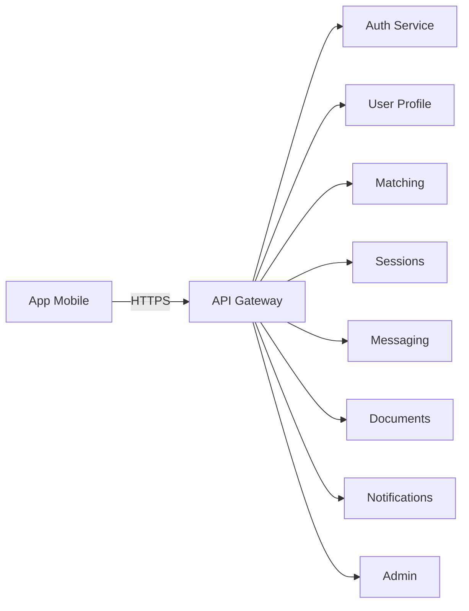

# SwapSkill (SkillSwap)

---

## 1. Présentation Générale

* **Nom de l'Application :** SkillSwap
* **Type :** Application mobile sociale d’échange de compétences (apprendre/enseigner) sans transaction financière.

### Objectif

Faciliter l’apprentissage accessible et local en mettant en relation des personnes qui souhaitent **enseigner** une compétence X et **apprendre** une compétence Y, via un système d’échange simple et sécurisé.

### Problèmes résolus

* Coût élevé et rigidité des cours traditionnels.
* Difficulté à trouver des pairs proches, disponibles et de confiance.
* Manque de structure pour planifier et valider des sessions d’échange.

### Fonctionnalités principales

* **Profils & Compétences :**

  * Création de profil (bio, photo, localisation approximative).
  * Déclaration “J’enseigne / J’apprends” (compétence, niveau, disponibilité).
* **Matching intelligent :**

  * Suggestions basées sur les compétences communes, la distance, la disponibilité et la réputation.
  * Filtres (rayon, niveau, langue, mode présentiel/distanciel).
* **Messagerie & Sessions :**

  * Chat en temps réel.
  * Proposition/confirmation de sessions (date, lieu/visio), rappels.
* **Avis & Réputation :**

  * Notes post-session, commentaires, badges (fiabilité, pédagogie).
* **Sécurité & Modération :**

  * Authentification JWT, vérification email, signalement/blocage d’utilisateur.
  * Paramètres de confidentialité (partage de position approximative).

### Utilité

Encourage le partage de savoirs, l’entraide locale et la montée en compétences continue, avec une barrière d’entrée minimale (pas d’échange d’argent).

---

## 2. Architecture Applicative

### Microservices identifiés

1. **Auth Service** : gestion des comptes, connexion, tokens JWT.
2. **User Profile Service** : profils, bio, localisation, compétences.
3. **Matching Service** : algorithme de suggestion, recherche filtrée.
4. **Sessions Service** : gestion des sessions (création, confirmation, annulation).
5. **Messaging Service** : chat en temps réel (WebSocket).
6. **Document Service** : gestion des fichiers uploadés et métadonnées.
7. **Analytics & Reputation Service** : calcul des scores de réputation, suivi des activités.
8. **Notification Service** : envoi des emails, push et notifications in-app.
9. **Admin Service** : outils de modération et supervision.
10. **API Gateway** : point d’entrée unique et sécurisation des appels.

### Schéma global



---

## 3. Choix des Bases de Données

* **Auth Service :** MariaDB/Postgres (gestion des utilisateurs, tokens, transactions).
* **User Profile :** Postgres avec JSONB (profils flexibles et requêtes relationnelles).
* **Matching :** Elasticsearch (recherche avancée, géolocalisation).
* **Sessions :** Postgres/MariaDB (intégrité des sessions et transactions).
* **Messaging :** MongoDB (flexible, optimisé pour messages volumineux).
* **Documents :** Postgres (métadonnées) + S3/Cloud (stockage binaire).
* **Analytics :** ClickHouse/InfluxDB (volumétrie élevée, analyses rapides).
* **Notifications :** Redis (queues, rapidité).

---

## 4. Gestion et Modélisation des Données

### Exemple : `users`

```sql
users (
  id UUID PRIMARY KEY,
  email VARCHAR UNIQUE,
  password_hash TEXT,
  name VARCHAR,
  role ENUM('user','admin'),
  created_at TIMESTAMP,
  is_verified BOOLEAN
)
```

### Exemple : `sessions`

```sql
sessions (
  id UUID PRIMARY KEY,
  proposer_id UUID,
  receiver_id UUID,
  skill_id UUID,
  start_at TIMESTAMP,
  end_at TIMESTAMP,
  place_or_link TEXT,
  status ENUM('PROPOSED','CONFIRMED','DONE','CANCELLED')
)
```

### Exemple : `messages`

```json
{
  "_id": "ObjectId",
  "conversation_id": "UUID",
  "sender_id": "UUID",
  "content": "string",
  "created_at": "datetime"
}
```

---

## 5. Processus de Création et Développement

### Conception

* Définition des personas et parcours utilisateurs.
* Prototypage avec **Figma**.

### Développement

* **Frontend :** React Native (Expo), TypeScript.
* **Backend :** Node.js, Express, Socket.io, REST API.
* **Base de données :** MariaDB/Postgres, MongoDB, Elasticsearch.

### Tests

* Unitaires, intégration, E2E (Detox).
* Tests de sécurité (injections, validation stricte).

### Déploiement

* Docker, Kubernetes (scalabilité), CI/CD (GitHub Actions).
* Monitoring : Prometheus, Grafana, Sentry.

---

## 6. Acteurs et Parties Prenantes

* Développeurs frontend et backend.
* DevOps/Infra.
* Testeurs QA.
* Utilisateurs finaux (enseignants/apprenants).
* Modérateurs et administrateurs.

---

## 7. Outils et Méthodologie

* **Agile Scrum** (sprints courts, daily stand-up).
* **Design** : Figma, Mermaid, Draw\.io.
* **Qualité** : ESLint, Prettier, Jest.
* **Sécurité** : HTTPS, JWT, Helmet, Zod/Joi.
* **CI/CD** : GitHub Actions, Docker.
* **Conformité** : RGPD (mentions légales, droit à l’oubli).

---

## 8. Backlog MVP (fonctionnalités prioritaires)

| Fonctionnalité                  | Taille | Priorité |
| ------------------------------- | ------ | -------- |
| Inscription / Connexion         | S      | Haute    |
| Création de profil utilisateur  | M      | Haute    |
| Ajout de compétences            | M      | Haute    |
| Recherche simple d’utilisateurs | M      | Haute    |
| Système de mise en relation     | L      | Haute    |
| Messagerie basique              | L      | Moyenne  |
| Notifications                   | M      | Moyenne  |
| Système de notation             | M      | Basse    |
| Gamification (badges, points)   | L      | Basse    |

---

## 9. Conclusion

SkillSwap propose une architecture microservices modulaire et scalable, adaptée à une application d’échange de compétences moderne. Le MVP se concentre sur :

* Authentification, profils, compétences.
* Matching et sessions.
* Messagerie et documents de base.

Les prochaines étapes incluent l’ajout de fonctionnalités avancées (recherche intelligente, réputation, analytics, gamification) et l’optimisation de la scalabilité via Kubernetes et CI/CD automatisé.

---
