# SwapSkill

---


## 1. Imaginer une Application

- **Nom de l'Application :** SkillSwap  
- **Type :** Application mobile sociale et collaborative d’échange de compétences (apprendre/enseigner) avec gamification, groupes, IA et classe virtuelle.  

---

## 2. Décrire l'Application

### Objectif
Faciliter l’apprentissage accessible, communautaire et motivant en mettant en relation des personnes qui souhaitent **enseigner** ou **apprendre** des compétences.  
Le tout avec un système **d’échange de savoirs**, de **classements**, de **groupes collaboratifs**, et d’**outils d’IA** pour accompagner enseignants et apprenants.

### Problèmes résolus
- Coût élevé et rigidité des cours traditionnels.  
- Manque de structure pour des apprentissages collaboratifs.  
- Manque de motivation sur le long terme.  
- Difficulté à valider la crédibilité (scams, faux profils).  
- Barrières linguistiques et connexions instables.  
- Besoin d’une plateforme unifiée et moderne pour l’apprentissage.

### Fonctionnalités principales
- **Profils & Compétences**
  - Création de profil (bio, photo, localisation approximative).
  - Déclaration “J’enseigne / J’apprends” (compétence, niveau, disponibilité).
  - Mini-vidéo de présentation (≤30s) pour dynamiser le profil.
  - Upload de certificats & diplômes (vérification → points + badge “Certifié”).
  - Vérification d’identité avancée (badge “Vérifié” via pièce d’identité).
- **Matching intelligent**
  - Suggestions basées sur les compétences communes, la distance, la disponibilité, la fiabilité et la réputation.
  - Filtres (rayon, niveau, langue, présentiel/distanciel).
- **Messagerie & Sessions**
  - Chat en temps réel (1–1 ou groupe) avec traduction instantanée.
  - Messages vocaux + partage de fichiers (PDF, images, supports pédagogiques).
  - Proposition/confirmation de sessions (date, lieu/visio) + rappels automatiques.
  - Mode hors-ligne : consulter profil, historiques, brouillons de messages/sessions.
- **Groupes collaboratifs**
  - Création de groupes par enseignants ou apprenants, rôles (admin, co-admin, membres).
  - Forums, fils de discussion, sondages, partage de ressources.
- **Classe virtuelle**
  - Visioconférences intégrées (WebRTC/Zoom), partage d’écran, tableau blanc, breakout rooms.
- **Partage & organisation**
  - Assignation de tâches et devoirs (deadline, pièces jointes).
  - Sondages et votes collaboratifs.
- **Ranking & Gamification**
  - Classements enseignants & apprenants (Daily, Weekly, Monthly, Yearly, All Time).
  - Points pour chaque action (enseigner, participer, publier, aider, certifier un diplôme, traductions utiles).
  - Badges (Mentor du mois, Apprenant persévérant, Super organisateur, Polyglotte, Toujours présent, Certifié).
  - Score de fiabilité (assurance communautaire) : pénalités si annulation tardive/no-show, bonus de ponctualité.
- **Évaluations enrichies**
  - Étoiles + critères : ponctualité, pédagogie, motivation/engagement, communication.
  - Avis textuels, votes “utile”.
- **Statistiques en temps réel**
  - Graphiques de diffusion des connaissances (jour/semaine/mois/année/global).
  - Indicateurs : sessions, tâches terminées, points cumulés, certificats validés, taux de fiabilité.
- **Personnalisation & Communauté**
  - Suggestions de groupes/pairs selon l’historique.
  - Section “Proposer une fonctionnalité” (soumissions + votes).
  - Notifications personnalisées (push/email).
- **Éducation formelle**
  - Mode Écoles/Universités : classes, enseignants, cours, devoirs, barèmes, export notes.
  - Tableau de bord admin établissement, personnalisation (logo, couleurs, privilèges).
- **Abonnements intelligents**
  - Gratuit (80% des fonctionnalités) : profils, matching, chat, sessions, certificats basiques.
  - Avancé (Premium) : stats détaillées, stockage accru, replay visioconf, assistants IA étendus, analytics perso.
  - VIP / Établissements : intégrations LMS/API, multi-groupes, analytics avancées, SSO.
- **IA Agents intégrés**
  - IA Mentor (parcours d’apprentissage personnalisés).
  - IA Assistant Prof (préparation de cours, tâches, quiz, corrections assistées).
  - IA Copilote Étudiant (explications, exercices, traduction, récap de session).
  - IA Modération (contenu, scams, sécurité).
  - IA Traduction Chat (realtime, multi-langues).
- **Sécurité & Modération**
  - Auth JWT + OAuth (Google/GitHub), 2FA optionnelle.
  - Vérification email/téléphone, KYC légère pour identité.
  - Signalement/blocage, masquage de localisation précise, RGPD.

---

## 2bis. Roadmap Fonctionnalités

### MVP (Version 1.0) — Core
- Authentification email/mot de passe, vérification email.
- Création de profil, bio, photo, localisation approximative.
- Déclarer “J’enseigne / J’apprends” avec niveau et disponibilité.
- Tags de compétences et langues.
- Matching basique par compétences, distance, disponibilité.
- Recherche par mots-clés et filtres (rayon, niveau, langue, distanciel/présentiel).
- Chat 1-1 temps réel (texte).
- Notifications push/email.
- Proposer/Confirmer une session avec rappels automatiques.
- Évaluations : étoiles + critères.
- Signalement et blocage d’utilisateurs.
- Admin minimal pour modération et bannissement.
- Sécurité API : rate-limit, Helmet, CORS.
- RGPD : consentement, export/suppression compte.

### Version 1.1 — Confiance et utilisabilité
- Login OAuth Google, vérification téléphone par OTP.
- Upload certificats/diplômes et affichage badge.
- Partage de fichiers dans le chat.
- Traduction basique du chat.
- Avis textuels et signalement de contenu.
- Score de fiabilité (no-show, annulations).
- Gamification : points, classement Top 10.
- Onboarding guidé.
- Admin dashboard plus complet.
- Préférences notifications et langues.
- File storage et crash/error logging.

### Version 1.2 — Engagement et communauté
- Vidéo de présentation ≤30s.
- Vérification manuelle certificats, badge certifié.
- KYC légère avec badge vérifié.
- Mode hors-ligne pour profils et historique messages.
- Votes “utile” sur avis, stats personnelles simples.
- Badge automatique via vérif diplôme.
- Modération IA de contenu.
- Scan antivirus sur fichiers uploadés.
- Observabilité minimale (métriques).
- Groupes collaboratifs simples, forum de groupe, tâches avec deadline.

### Version 2.0 — Premium et avancé
- 2FA optionnelle.
- Messages vocaux dans le chat.
- Visioconférence intégrée WebRTC/Zoom.
- Breakout rooms et tableau blanc collaboratif.
- Abonnements Premium/VIP.
- Mode Écoles/Universités avec exports.

---

# 3. Architecture de l’Application

## 3.1 Microservices

### MVP (v1.0)

| Microservice           | Rôle                                                                                             | Interactions principales                            |
| ---------------------- | ------------------------------------------------------------------------------------------------ | --------------------------------------------------- |
| **Auth & Users**       | Authentification email/mot de passe, profils de base (bio, photo, localisation).                 | Utilisé par tous les autres services.               |
| **Skills & Matching**  | Déclaration et recherche de compétences, matching basique (compétence, disponibilité, distance). | Connecté à Users et Sessions.                       |
| **Chat (texte)**       | Messagerie 1-1 en temps réel (texte uniquement).                                                 | Relié à Auth pour permissions, stocke les messages. |
| **Sessions**           | Proposer/Confirmer sessions avec rappels automatiques.                                           | Interagit avec Users, Matching, Notifications.      |
| **Reviews**            | Évaluations sessions (étoiles + critères).                                                       | Relié à Sessions et Users.                          |
| **Notifications**      | Push/email pour rappels sessions.                                                                | Déclenché par Sessions.                             |
| **Admin & Modération** | Outils minimaux de bannissement et signalements.                                                 | Relié à Users et Reviews.                           |

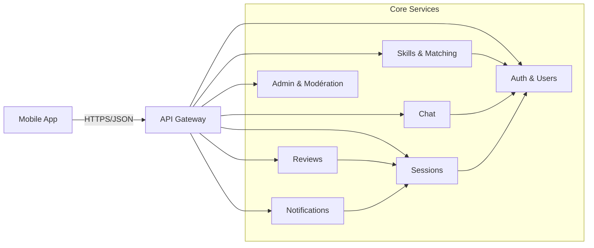

## Explication — MVP (v1.0)

1. L’app parle à l’**API Gateway**, qui route vers **Auth, Matching, Chat, Sessions, Reviews, Notifications, Admin**.
2. Les appels sont **directs** (REST) ; seuls les rappels passent par **Notifications** en **asynchrone**.
3. **Reviews** vérifie d’abord la **Session** avant d’accepter une note.
4. Si **Notifications** tombe, la session se crée quand même : les rappels partiront plus tard.
---

### Version 1.1 – Confiance et utilisabilité

| Microservice                      | Rôle                                         | Interactions principales                              |
| --------------------------------- | -------------------------------------------- | ----------------------------------------------------- |
| **OAuth & Identity**              | Auth via Google/OTP, vérification téléphone. | Remplace/améliore Auth.                               |
| **File Storage (certificats)**    | Upload diplômes, images.                     | Relié aux profils Users.                              |
| **Content Reporting**             | Signalement contenu/messages.                | Relié à Chat et Admin.                                |
| **Gamification v1**               | Points de base, classement Top 10.           | Collecte d’événements depuis Sessions, Reviews, Chat. |
| **Translation Service (basique)** | Traduction du chat.                          | Relié à Chat.                                         |

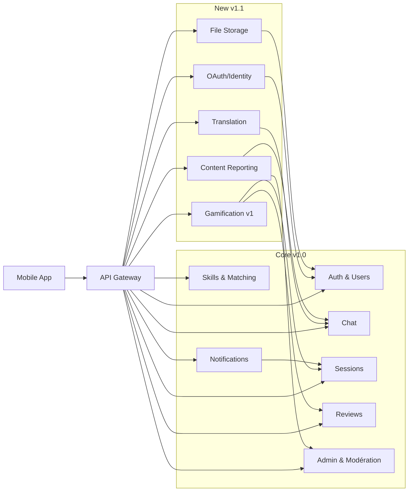


## Explication — v1.1

1. On ajoute **OAuth/OTP**, **Fichiers**, **Gamification v1**, **Traduction basique**, **Signalement contenu**.
2. **OAuth** gère la connexion et met à jour le profil côté **Auth**.
3. **Fichiers** stocke pièces jointes et certificats ; **Chat** y référence les documents.
4. **Gamification** écoute les **événements** (sessions, avis, messages) et met à jour les points/classements sans bloquer l’usage.
---

### Version 1.2 – Engagement et communauté

| Microservice              | Rôle                                                  | Interactions principales       |
| ------------------------- | ----------------------------------------------------- | ------------------------------ |
| **KYC léger**             | Vérification identité (badge vérifié).                | Relié à Users.                 |
| **Video Profiles**        | Mini-vidéo de présentation ≤30s.                      | Relié à File Storage.          |
| **Offline Mode**          | Consultation profils/messages hors ligne.             | Relié à Cache local.           |
| **Groups & Tasks**        | Groupes collaboratifs, forums, tâches avec deadlines. | Relié à Users et File Storage. |
| **Gamification v2**       | Stats personnelles, badges, votes utiles.             | Améliore Gamification v1.      |
| **Content Moderation AI** | Détection contenu frauduleux.                         | Relié à Chat et Groups.        |

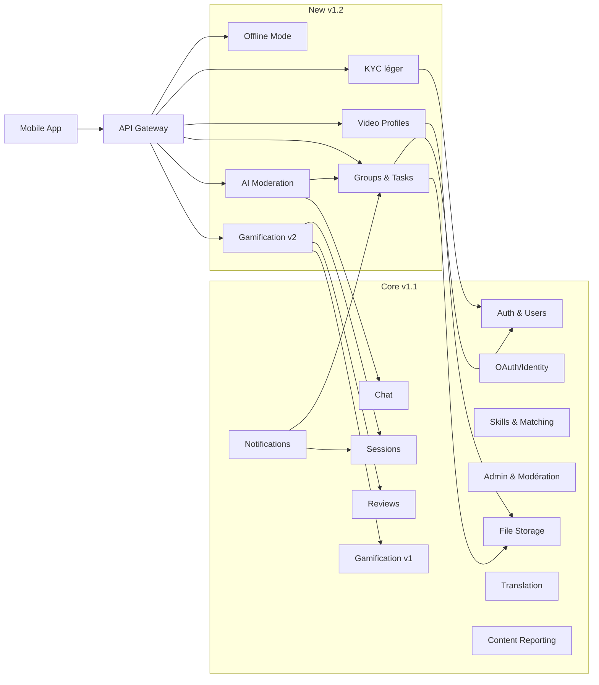

---

## Explication — v1.2

1. On ajoute **KYC**, **Vidéo profil**, **Mode hors-ligne**, **Groupes & Tâches**, **Gamification v2**, **Modération IA**.
2. **KYC** pose un badge vérifié dans **Auth** ; **Vidéo profil** passe par **Fichiers**.
3. **Groupes & Tâches** utilisent **Auth** (rôles) et **Fichiers** (ressources).
4. **Modération IA** analyse **Chat**/**Groupes** en arrière-plan et signale à **Admin** en cas de problème.
---

### Version 2.0 – Premium et avancé

| Microservice               | Rôle                                                      | Interactions principales                |
| -------------------------- | --------------------------------------------------------- | --------------------------------------- |
| **Video & Virtual Class**  | Visioconférences WebRTC, tableau blanc, breakout rooms.   | Relié à Sessions et Groups.             |
| **Voice Messages**         | Messages vocaux dans le chat.                             | Relié à Chat.                           |
| **Gamification v3**        | Classements avancés (daily, weekly, monthly…), fiabilité. | Collecte événements globaux.            |
| **Premium Subscriptions**  | Gestion abonnements Premium/VIP.                          | Relié à Payments.                       |
| **AI Mentor/Prof/Student** | Parcours personnalisés, aide aux devoirs, quiz.           | Relié à Users et Sessions.              |
| **AI Translation avancée** | Traduction illimitée multilingue.                         | Relié à Chat et Groups.                 |
| **Payments**               | Abonnements, institutions (écoles/universités).           | Relié à Users et Premium Subscriptions. |

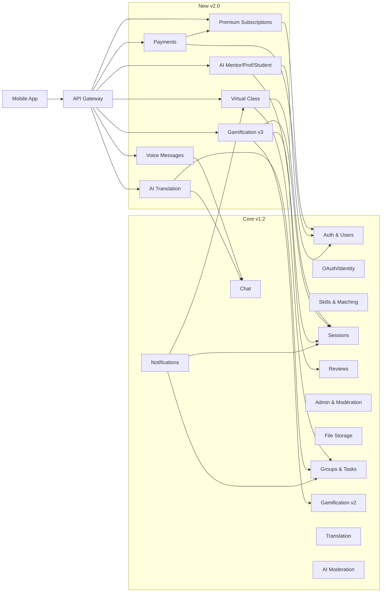
## Explication — v2.0

1. On ajoute **Classe virtuelle**, **Vocal**, **Gamification v3**, **Abonnements**, **Paiements**, **Agents IA**, **Traduction avancée**.
2. **Classe virtuelle** s’attache à une **Session** ou un **Groupe** ; **Vocal** s’intègre au **Chat**.
3. **Abonnements** s’appuient sur **Paiements** ; les droits actifs sont stockés côté **Auth**.
4. **Agents IA** utilisent les données autorisées (profil/sessions) pour aider, sans bloquer le reste de l’app.
---

## 3.2 Bases de Données

| Microservice              | Base de données                                                  | Justification                                                  |
| ------------------------- | ---------------------------------------------------------------- | -------------------------------------------------------------- |
| **Auth & Users**          | MongoDB                                                          | Flexible, profils + préférences.                               |
| **Skills & Matching**     | MongoDB → Elasticsearch (futur)                                  | MongoDB simple au MVP, Elasticsearch pour recherches avancées. |
| **Chat (texte)**          | MongoDB + Redis (futur)                                          | Mongo pour persistance, Redis pour scalabilité temps réel.     |
| **Sessions**              | MongoDB                                                          | Semi-structuré (dates, statuts, users).                        |
| **Reviews**               | MongoDB                                                          | Stockage souple, critères variables.                           |
| **Notifications**         | Firebase/Expo + Mongo (logs)                                     | Solution scalable pour push/email.                             |
| **File Storage**          | S3/Drive                                                         | Stockage objets lourds (vidéos, images).                       |
| **Groups & Tasks**        | MongoDB                                                          | Structure flexible (membres, discussions, tâches).             |
| **Gamification**          | MongoDB                                                          | Événements utilisateurs + scores.                              |
| **Video & Virtual Class** | WebRTC/Zoom API (pas de DB interne, juste métadonnées en Mongo). | Pas de stockage natif de flux vidéo.                           |
| **Payments**              | PostgreSQL                                                       | Cohérence forte nécessaire pour transactions financières.      |
| **AI Services**           | APIs externes + MongoDB (logs, feedback IA).                     | IA hébergée externe, persistance locale pour suivi.            |

---

## 3.3 Gestion des Données — Modélisation (résumé concret)

### MVP (v1.0)

* **Auth & Users**
  Données : profil (nom, email, photo, langue, rôles, localisation approx).
  Structure : **doc Mongo `User`**, index **email (unique)**.
  Usage : login/JWT, affichage profil, contrôle d’accès.

* **Skills & Matching**
  Données : compétences par user (label, type TEACH/LEARN, niveau, dispo).
  Structure : **doc Mongo `Skill`** (1..n / user), index **label (texte), type, niveau**.
  Usage : recherche + filtres, suggestions basiques.

* **Sessions**
  Données : rendez-vous (participants, dates, lieu/lien, statut).
  Structure : **doc Mongo `Session`**, index **userAId/userBId, startAt, status**.
  Usage : planification, changements d’état, déclenchement rappels.

* **Chat (texte)**
  Données : messages 1–1 (texte, langue, horodatage).
  Structure : **doc Mongo `Message`** lié à `sessionId`, index **sessionId+createdAt**.
  Usage : timeline, pagination.

* **Reviews**
  Données : avis (étoiles + critères, commentaire).
  Structure : **doc Mongo `Review`**, contrainte **unique (sessionId, reviewerId)**.
  Usage : réputation/notes de profil.

* **Notifications**
  Données : journal d’envoi (type, cible, statut).
  Structure : **doc Mongo `NotificationLog`**, index **userId+sentAt** (TTL possible).
  Usage : audit des push/email, replays si échec.

* **Admin & Modération**
  Données : signalements (cible, motif, statut).
  Structure : **doc Mongo `Report`**, index **status, reportedUserId**.
  Usage : tri, décision, traçabilité.

---

### Ajouts v1.1

* **OAuth & Identity**
  Données : liens SSO (provider, providerId), téléphone vérifié (OTP).
  Structure : **`IdentityLink`**, **`PhoneVerification`**, index **(provider, providerId)** unique / **phone** unique.
  Usage : connexion simplifiée, renforcement identité.

* **File Storage (métadonnées)**
  Données : fichiers (type CERTIFICATE/ATTACHMENT, url, mime, taille, scan).
  Structure : **doc `File`** (blobs sur S3/Drive), index **ownerId+type**.
  Usage : certificats, pièces jointes de chat.

* **Gamification v1**
  Données : événements d’activité, tableaux Top10.
  Structure : **`ActivityEvent`**, **`Leaderboard`**, index **timeframe+score**.
  Usage : points & classement.

* **Translation (basique)**
  Données : texte traduit.
  Structure : champs **`translatedText`, `translatedLang`** sur `Message`.
  Usage : lecture multilingue à la demande.

---

### Ajouts v1.2

* **KYC léger**
  Données : statut de vérification (PENDING/APPROVED/REJECTED).
  Structure : **doc `KYCCheck`** lié à `userId`.
  Usage : badge vérifié (miroir dans `User.idVerified`).

* **Video Profiles**
  Données : vidéo ≤30s (url, durée).
  Structure : **doc `Media` (INTRO_VIDEO)**, blob sur S3.
  Usage : présentation sur profil.

* **Groups & Tasks**
  Données : groupes, membres, tâches (statut, deadline).
  Structure : **`Group`**, **`GroupMembership`**, **`Task`** ; index **groupId, status, deadline**.
  Usage : forums/organisation en petits groupes.

* **Gamification v2**
  Données : badges, stats personnelles.
  Structure : **`Badge`**, **`UserBadge`**, **`UserStats`**.
  Usage : engagement, reconnaissance.

* **AI Moderation**
  Données : flags de contenu (score, labels, statut).
  Structure : **doc `ModerationFlag`** (cible = message/post/fichier).
  Usage : file d’attente pour revue admin.

---

### Ajouts v2.0

* **Video & Virtual Class**
  Données : salles (contexte session/groupe), enregistrements.
  Structure : **`Room`**, **`Recording`** (métas Mongo, médias S3).
  Usage : cours live, replays.

* **Voice Messages**
  Données : audio + transcription (option).
  Structure : champs **`audioUrl`**, `transcript` sur `Message`.
  Usage : échanges vocaux intégrés au chat.

* **Premium Subscriptions**
  Données : abonnement (plan, statut, période), droits actifs.
  Structure : **`Subscription`**, **`Entitlement`** (Mongo/PG).
  Usage : activation des features premium.

* **Payments (PostgreSQL)**
  Données : intents, factures, client, statuts.
  Structure : tables **`payment_intent`**, **`invoice`**, FK `user_id`.
  Usage : encaissement, conformité.

* **AI Agents / Translation avancée**
  Données : sessions d’IA, messages, feedback ; logs de traduction.
  Structure : **`AiSession`**, **`AiMessage`**, **`AiFeedback`**.
  Usage : mentorat, aide pédagogique, meilleure traduction.

---

## 3.4 Diagramme global (MVP + évolutions)

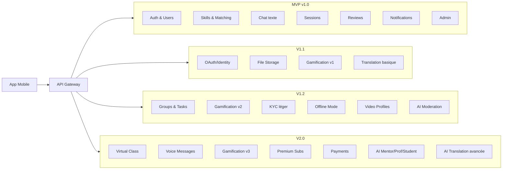

### Modèle de données (simplifié)

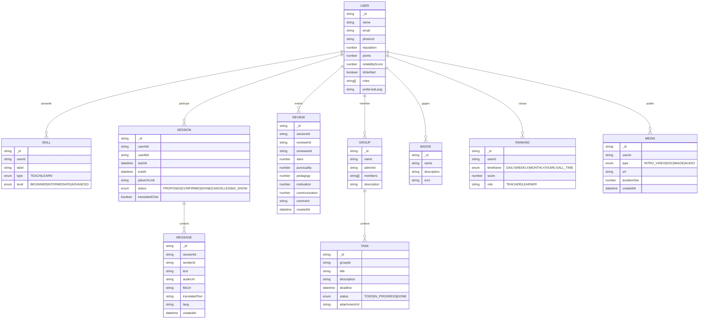

---

## 4. Processus de Création

### Conception

* Besoins utilisateurs & institutions, personas (étudiant, prof, mentor, école).
* Wireframes Figma : profils (avec vidéo), chat (texte/vocal/fichiers), session, groupe, stats, classements.
* UX : gamification visible (points, badges, fiabilité), gestion hors-ligne (états de sync).
* Accessibilité & internationalisation (i18n).

### Développement

* **Frontend** : React Native (Expo), TypeScript, i18n, stockage local (SQLite/AsyncStorage) pour le **mode hors-ligne**.
* **Backend** : Node.js, Express (REST), Socket.io (chat/notifications), Mongoose (MongoDB).
* **Vidéo** : WebRTC/Zoom SDK.
* **Fichiers** : S3/Drive, antivirus scan, limites de taille.
* **IA** : LLMs (Assistant Prof/Mentor/Étudiant), **traduction chat** en temps réel, modération.
* **Auth** : JWT + OAuth, 2FA optionnelle.
* **Gamification** : microservice scoring/ranking, jobs CRON pour classements (daily/weekly…).

### Test

* Unitaires : scoring, fiabilité (annulation tardive/no-show), IA helpers (mocks), traduction.
* Intégration : API JWT, upload fichiers, visioconf, offline sync.
* E2E mobile (Detox) : onboarding → match → chat (traduction) → session → review (critères).
* Charge : chat de groupe + vidéo + uploads simultanés.
* Sécurité : validation stricte, XSS, rate-limit, contrôle d’accès (groupes, fichiers).

### Déploiement

* Backend : Docker + Railway/Render/Fly, secrets managés.
* DB : MongoDB Atlas (backup, IP allowlist).
* Mobile : Expo EAS Build + EAS Update (OTA).
* Observabilité : logs (pino), Sentry, métriques (Prometheus/Grafana).

### Maintenance

* CI/CD GitHub Actions (lint/test/build/deploy).
* Roadmap ouverte (Issues, votes “feature requests”).
* Politique de versions (semver), changelog, releases.
* Amélioration continue IA & traduction (qualité, latence, coût).

---

## 5. Acteurs et Parties prenantes

* **Acteurs**

  * Dev mobile (RN/Expo), dev backend (Node/Express), IA/ML, DevOps.
  * QA/Test, Modération & Support.
  * Utilisateurs finaux (apprenants, enseignants), Admins de groupes.
  * Écoles/Universités (admins établissement).

* **Parties prenantes**

  * Communautés locales, associations.
  * Stores mobiles, partenaires IA et visioconf, hébergeurs cloud.

---

## 6. Outils et Protocoles

* **Gestion** : Agile/Scrum, GitHub Projects, PR reviews.
* **Design** : Figma, Mermaid.
* **Stack** : React Native (Expo), Node.js, Express, MongoDB, Socket.io, WebRTC, S3, LLM APIs.
* **Qualité** : ESLint, Prettier, Jest, RTL, Supertest, Detox.
* **Sécurité** : HTTPS, JWT, Helmet, RGPD, KYC léger, scan fichiers, secrets manager.
* **CI/CD** : GitHub Actions, Docker, Sentry, Prometheus/Grafana.

---

## 7. Profils & User Flows (par version)

### 7.1 Profils cibles

* **Apprenant (Learner)** : cherche à apprendre une compétence.
* **Enseignant (Teacher)** : propose d’enseigner une compétence.
* **Dual-mode (Learner↔Teacher)** : alterne les deux rôles.
* **Admin/Modération** : surveille, modère, gère les signalements.
* **Établissement (v2.0)** : admin d’une école/université (premium).

---

### 7.2 Flows — MVP (v1.0)

#### 7.2.1 Flow Apprenant (MVP)

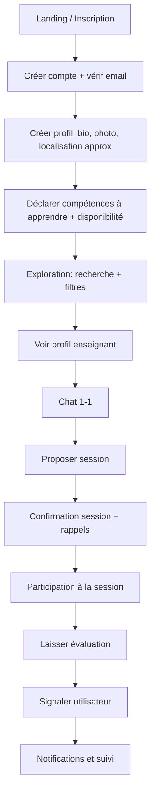

#### 7.2.2 Flow Enseignant (MVP)

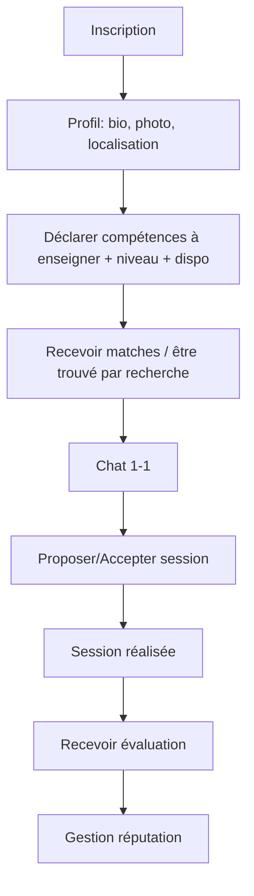

#### 7.2.3 Flow Admin & Modération (MVP)

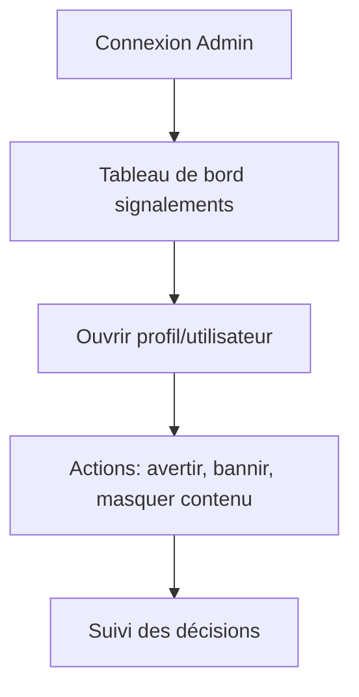

---

### 7.3 Flows — v1.1 (Confiance & utilisabilité)

#### 7.3.1 OAuth + Vérif téléphone + Certificats

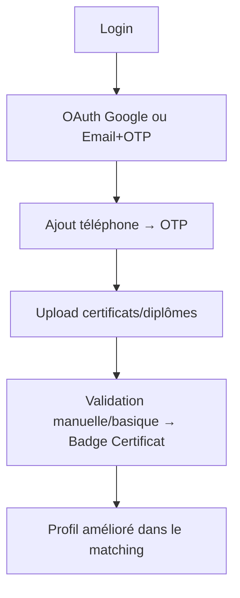

#### 7.3.2 Chat avec fichiers + Traduction basique

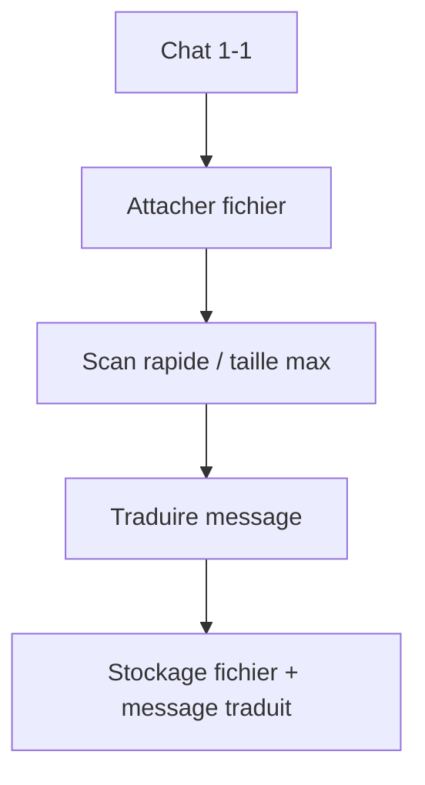

#### 7.3.3 Gamification v1 (points + Top 10)

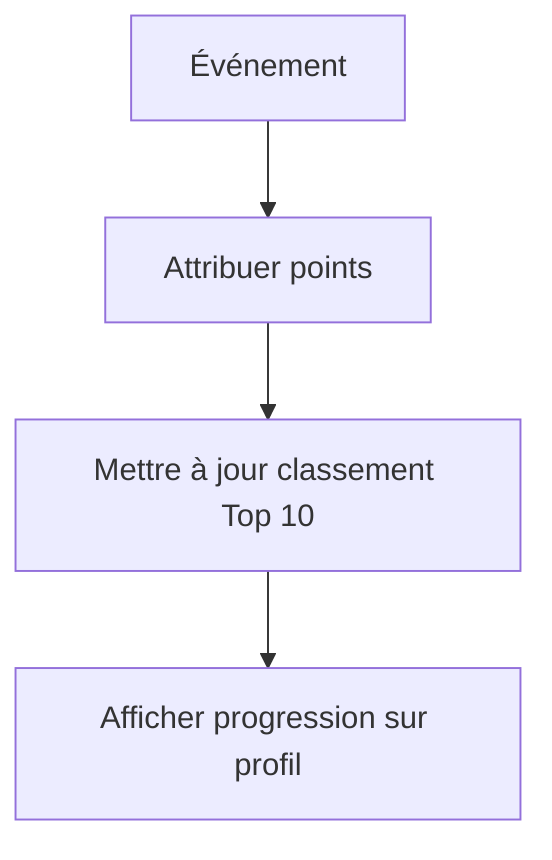

---

### 7.4 Flows — v1.2 (Engagement & communauté)

#### 7.4.1 KYC léger + Vidéo de présentation

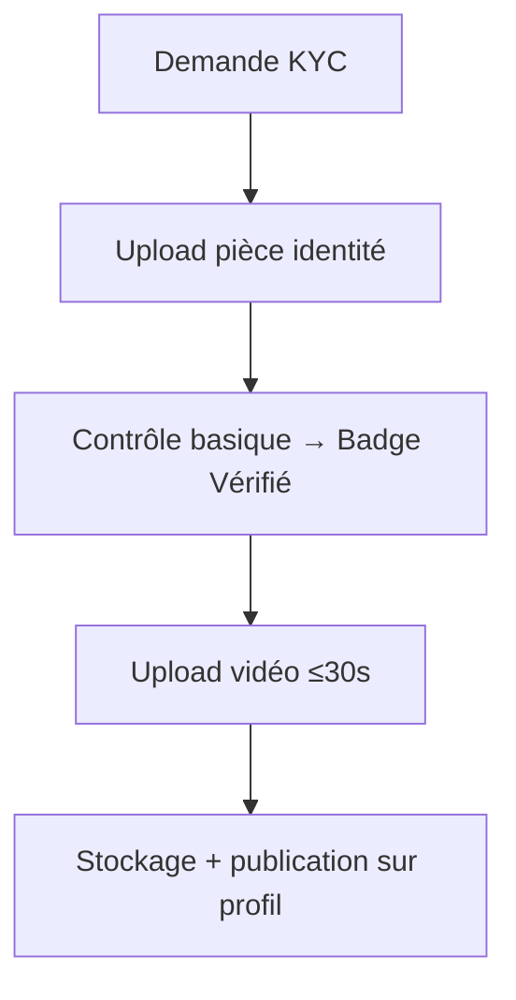

#### 7.4.2 Groupes collaboratifs + Tâches

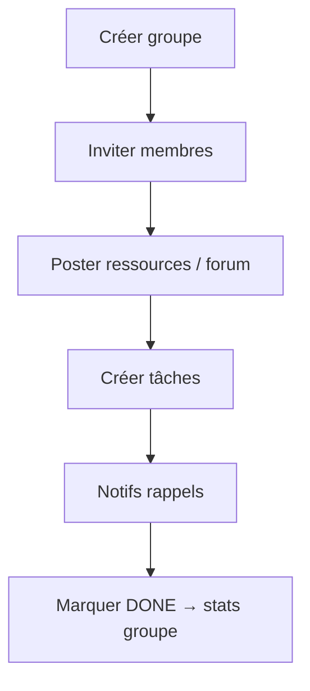

#### 7.4.3 Mode hors-ligne (profils + historique chat)

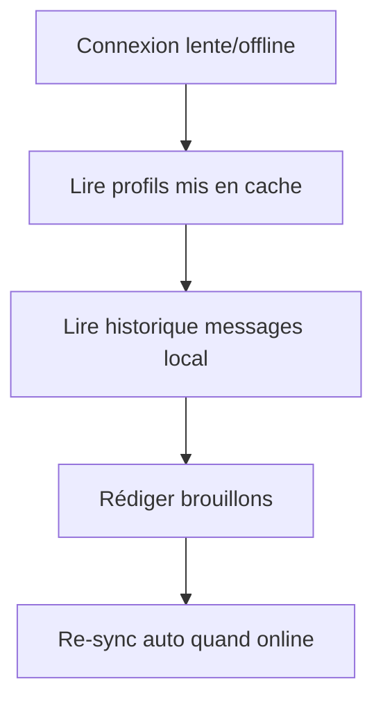

---

### 7.5 Flows — v2.0 (Premium & avancé)

#### 7.5.1 Classe virtuelle (WebRTC) + Breakout rooms

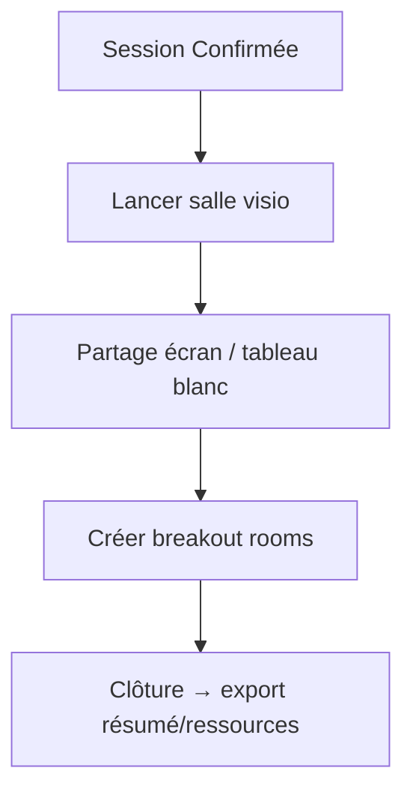

#### 7.5.2 Abonnements & Paiements

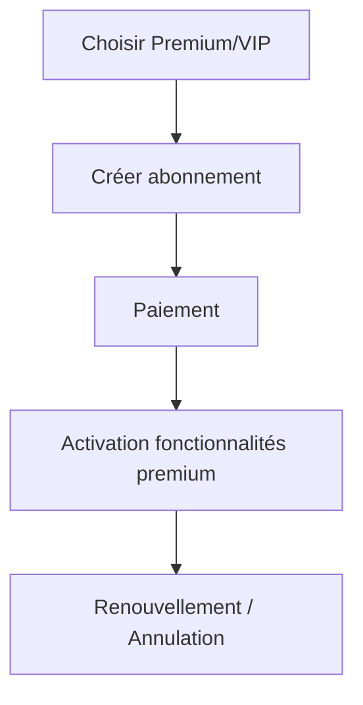

---

Gotcha — here’s a **super-simple, paste-ready pack** to replace your current Use Cases.
I kept only short one-liners + tiny diagrams.

---

## 8. Use Cases — Version **simple**

### 8.1 MVP (v1.0)

#### Apprenant (Learner)

| ID    | Intention           | Déclencheur → Action         | Résultat                 |
| ----- | ------------------- | ---------------------------- | ------------------------ |
| UC-L1 | Créer un compte     | App → S’inscrire (email+pwd) | Compte actif             |
| UC-L2 | Trouver un prof     | Rechercher + filtres         | Liste pertinente         |
| UC-L3 | Démarrer un échange | Ouvrir profil → “Contacter”  | Conversation créée       |
| UC-L4 | Planifier           | “Proposer une session”       | Session **PROPOSED**     |
| UC-L5 | Être rappelé        | Session confirmée            | Push/email avant session |
| UC-L6 | Évaluer             | Fin de session → Noter       | Avis enregistré          |

#### Enseignant (Teacher)

| ID    | Intention            | Déclencheur → Action                | Résultat                      |
| ----- | -------------------- | ----------------------------------- | ----------------------------- |
| UC-T1 | Se présenter         | Compléter profil + skills           | Profil visible                |
| UC-T2 | Répondre             | Ouvrir chat → répondre              | Conversation active           |
| UC-T3 | Confirmer            | Voir proposition → accepter/refuser | Session **CONFIRMED** / refus |
| UC-T4 | Suivre sa réputation | Consulter notes                     | Score visible                 |

#### Admin

| ID    | Intention   | Déclencheur → Action  | Résultat             |
| ----- | ----------- | --------------------- | -------------------- |
| UC-A1 | Modérer     | Ouvrir un signalement | Décision journalisée |
| UC-A2 | Sanctionner | Bloquer/bannir        | Accès restreint      |

##### Mini-flow MVP

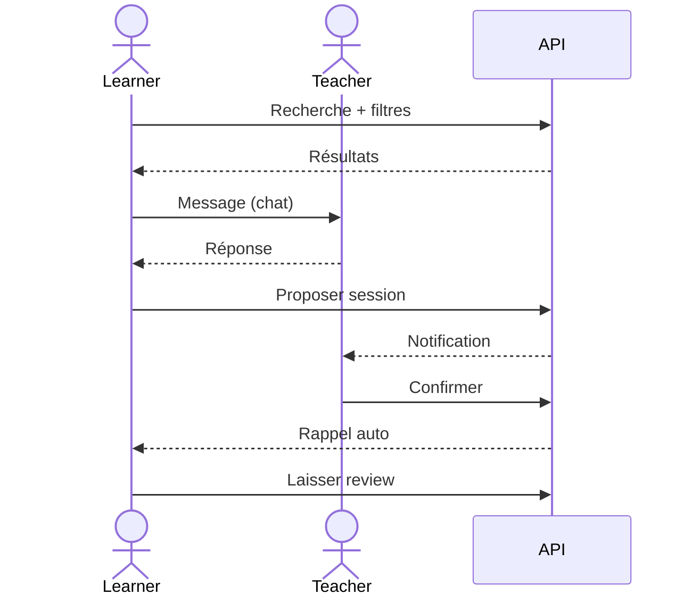

---

### 8.2 v1.1 (Confiance & utilisabilité)

| ID       | Intention           | Action brève             | Résultat           |
| -------- | ------------------- | ------------------------ | ------------------ |
| UC-ID1   | Login simplifié     | OAuth Google / Email+OTP | Connecté           |
| UC-ID2   | + Sécurité          | Vérif téléphone (OTP)    | Numéro validé      |
| UC-DOC1  | Prouver compétences | Upload certificat        | Badge “Certificat” |
| UC-CHAT1 | Partager fichier    | Pièce jointe dans chat   | Fichier dispo      |
| UC-TR1   | Comprendre          | Traduire un message      | Texte traduit      |
| UC-GAM1  | Motiver             | Gagner points            | Top 10 mis à jour  |

##### Mini-flow v1.1

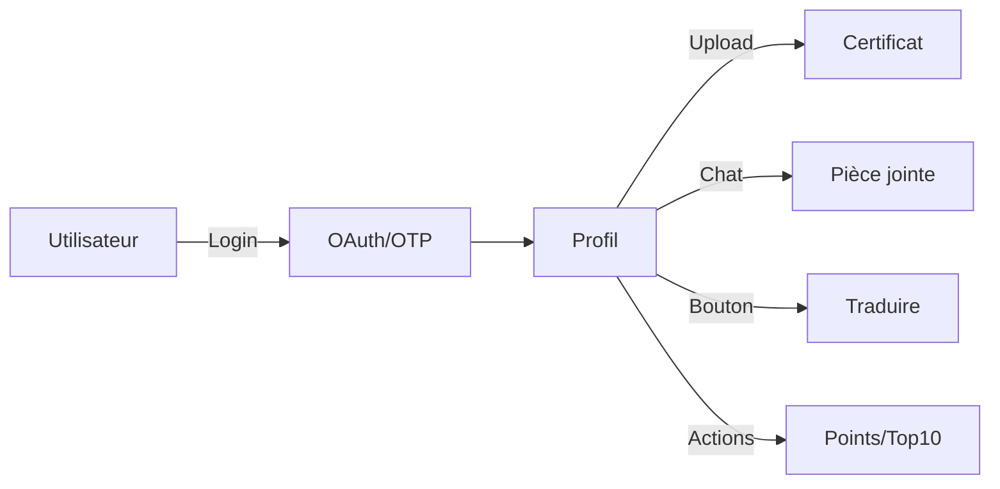

---

### 8.3 v1.2 (Engagement & communauté)

| ID        | Intention           | Action brève                   | Résultat          |
| --------- | ------------------- | ------------------------------ | ----------------- |
| UC-KYC1   | Inspirer confiance  | KYC léger                      | Badge “Vérifié”   |
| UC-VID1   | Se présenter        | Vidéo ≤30s                     | Vidéo sur profil  |
| UC-GRP1   | Apprendre en groupe | Créer groupe                   | Espace actif      |
| UC-TASK1  | Organiser           | Créer tâche + deadline         | Suivi des tâches  |
| UC-OFF1   | Continuer offline   | Lire cache / rédiger brouillon | Sync auto ensuite |
| UC-AIMOD1 | Propreté            | Modération IA                  | Contenu flaggé    |

##### Mini-flow v1.2

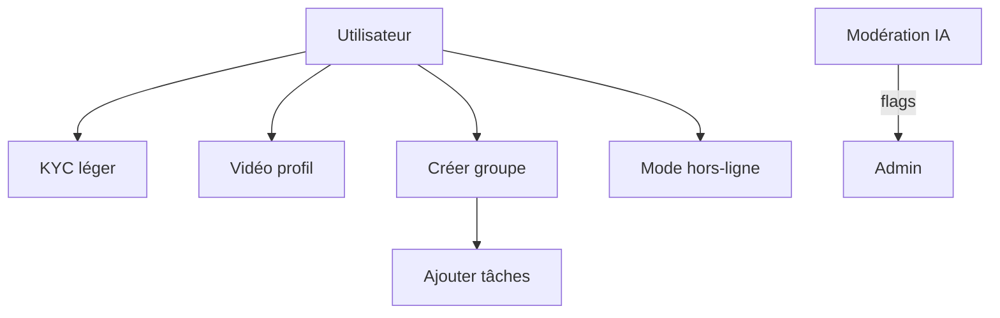

---

### 8.4 v2.0 (Premium & avancé)

| ID          | Intention            | Action brève            | Résultat          |
| ----------- | -------------------- | ----------------------- | ----------------- |
| UC-VIDROOM1 | Donner cours en live | Ouvrir classe virtuelle | Salle active      |
| UC-VOICE1   | Échanger en vocal    | Envoyer vocal           | Audio dans chat   |
| UC-SUB1     | Passer Premium       | Choisir plan + payer    | Avantages activés |
| UC-PAY1     | Gérer paiement       | Voir/annuler abonnement | Facturation OK    |
| UC-AI1      | Être guidé           | Lancer Mentor IA        | Recos/quiz        |
| UC-TR2      | Traduire mieux       | Traduction avancée      | Texte enrichi     |

##### Mini-flow v2.0

```mermaid
sequenceDiagram
actor User
User->>API: Choisir Premium
API->>Payments: Créer paiement
Payments-->>API: OK (webhook)
API-->>Auth: Activer droits
User->>VirtualClass: Rejoindre salle
VirtualClass-->>User: Audio/vidéo ok
User->>Chat: Envoyer vocal
```

---

## 10. Critères d’acceptation (échantillons MVP)

* **Recherche (UC-L01)** : filtrer par compétence, niveau, langue, rayon; résultats < 1s sur 10k profils; aucun résultat → message d’aide.
* **Chat (UC-L02)** : première réponse push reçue en < 3s; persistance des messages.
* **Session (UC-L03)** : statut passe PROPOSED→CONFIRMED; rappels J-1 et H-1.
* **Évaluation (UC-L04)** : une seule review par session et par utilisateur; modification permise < 24h.
* **Signalement (UC-L05)** : ticket créé, visibilité admin seulement; SLA tri < 24h.

---

## Gamification & Ranking

### Classements

* Enseignants & apprenants : Daily, Weekly, Monthly, Yearly, All Time (Top 10 + progression).

### Points (exemples)

* Profil complet +50, Déclarer une compétence +20, Participer +30, Enseigner +50,
  Terminer tâche +40, Publier ressource +25, Visioconf +35, 5⭐ reçu +100,
  Avis constructif +20, Sondage +30, **Certificat validé +80**, **Annulation tardive −60**.

### Badges (échantillon)

* Mentor du mois, Apprenant persévérant, Réponse utile, Super organisateur,
  Toujours présent, Polyglotte, **Certifié**, **Fiabilité 95%+**.

### Statistiques (temps réel)

* Sessions, tâches, diplômes validés, diffusion du savoir, fiabilité moyenne, langues utilisées (traduction).

### Communauté

* **Proposer une fonctionnalité** (soumissions + votes), points bonus pour contributeurs.

---

## Abonnements & Monétisation

* **Gratuit (80%)** : profils, matching, chat, sessions, traduction chat limitée, certificats basiques.
* **Avancé (Premium)** : stats détaillées, stockage accru, replay vidéos, assistants IA étendus, traduction illimitée.
* **VIP / Établissements** : intégrations LMS/API/SSO, analytics avancées, multi-groupes, branding.

---

## Vision finale

Faire de **SwapSkill** le **hub central du savoir**, alliant **communauté**, **éducation formelle**, **gamification**, **multilingue** et **IA** pour créer un écosystème unique de partage de connaissances — accessible même **hors-ligne**.

```
