# SwapSkill – MVP v1.0

---

# 1. Imaginer une Application

- **Nom de l'Application :** SkillSwap  
- **Type :** Application mobile sociale et collaborative d’échange de compétences (apprendre/enseigner) avec gamification, groupes, IA et classe virtuelle.  

---

# 2. Décrire l'Application

### Objectif
Faciliter l’apprentissage accessible, communautaire et motivant en mettant en relation des personnes qui souhaitent **enseigner** ou **apprendre** des compétences.  
Le tout avec un système **d’échange de savoirs**, de **classements**, de **groupes collaboratifs**, et d’**outils d’IA** pour accompagner enseignants et apprenants.

### Problèmes résolus
- Coût élevé et rigidité des cours traditionnels.  
- Manque de structure pour des apprentissages collaboratifs.  
- Manque de motivation sur le long terme.  
- Difficulté à valider la crédibilité (scams, faux profils).  
- Barrières linguistiques et connexions instables.  
- Besoin d’une plateforme unifiée et moderne pour l’apprentissage.

### Fonctionnalités principales
- **Profils & Compétences**
  - Création de profil (bio, photo, localisation approximative).
  - Déclaration “J’enseigne / J’apprends” (compétence, niveau, disponibilité).
  <!-- - Mini-vidéo de présentation (≤30s) pour dynamiser le profil. -->
  <!-- - Upload de certificats & diplômes (vérification → points + badge “Certifié”). -->
  <!-- - Vérification d’identité avancée (badge “Vérifié” via pièce d’identité). -->
- **Matching intelligent**
  - Suggestions basées sur les compétences communes, la distance et la disponibilité.
  <!--
  ## 3.4 Diagramme global (MVP + évolutions)

  **Titre du diagramme :** Vue d’ensemble des évolutions microservices
  ```mermaid
  flowchart LR
    App[App Mobile]
    API[API Gateway]

    subgraph Core [MVP v1.0]
      Auth[Auth & Users]
      Match[Skills & Matching]
      Chat[Chat texte]
      Sess[Sessions]
      Rev[Reviews]
      Notif[Notifications]
      Admin[Admin]
    end

    subgraph V1.1
      OAuth[OAuth/Identity]
      Files[File Storage]
      Gam1[Gamification v1]
      Trans1[Translation basique]
    end

    subgraph V1.2
      Groups[Groups & Tasks]
      Gam2[Gamification v2]
      KYC[KYC léger]
      Offline[Offline Mode]
      VidProf[Video Profiles]
      AIMod[AI Moderation]
    end

    subgraph V2.0
      Video[Virtual Class]
      Voice[Voice Messages]
      Gam3[Gamification v3]
      Premium[Premium Subs]
      Pay[Payments]
      AIAgents[AI Mentor/Prof/Student]
      Trans2[AI Translation avancée]
    end

    App --> API
    API --> Core
    API --> V1.1
    API --> V1.2
    API --> V2.0
  ```

  ### Modèle de données (simplifié)

  **Titre du diagramme :** Modèle conceptuel des données principales
  ```mermaid
  erDiagram
    USER ||--o{ SKILL : possede
    USER ||--o{ SESSION : participe
    USER ||--o{ REVIEW : evalue
    SESSION ||--o{ MESSAGE : contient
    USER ||--o{ GROUP : membre
    GROUP ||--o{ TASK : contient
    USER ||--o{ BADGE : gagne
    USER ||--o{ RANKING : classe
    USER ||--o{ MEDIA : publie

    USER {
      string _id
      string name

<!--

### 7.3 Flows — v1.1 (Confiance & utilisabilité)

#### 7.3.1 OAuth + Vérif téléphone + Certificats

**Titre du diagramme :** Renforcement de la confiance – parcours v1.1
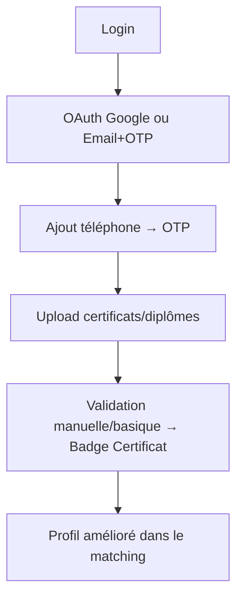

#### 7.3.2 Chat avec fichiers + Traduction basique

**Titre du diagramme :** Enrichissement du chat – fonctionnalités v1.1
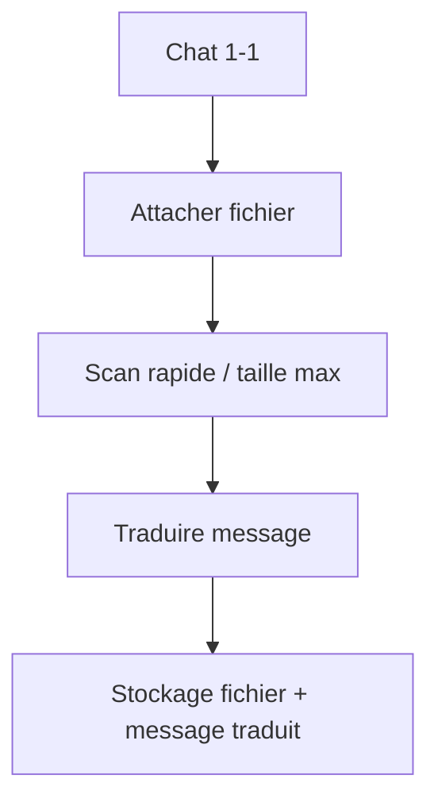

#### 7.3.3 Gamification v1 (points + Top 10)

**Titre du diagramme :** Boucle de gamification – version 1.1
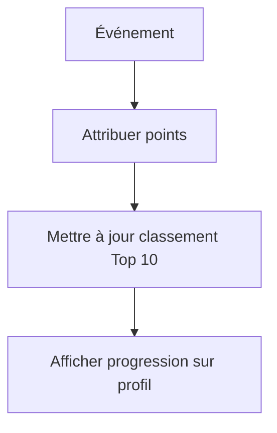

---

### 7.4 Flows — v1.2 (Engagement & communauté)

#### 7.4.1 KYC léger + Vidéo de présentation

**Titre du diagramme :** Parcours de confiance avancé – version 1.2
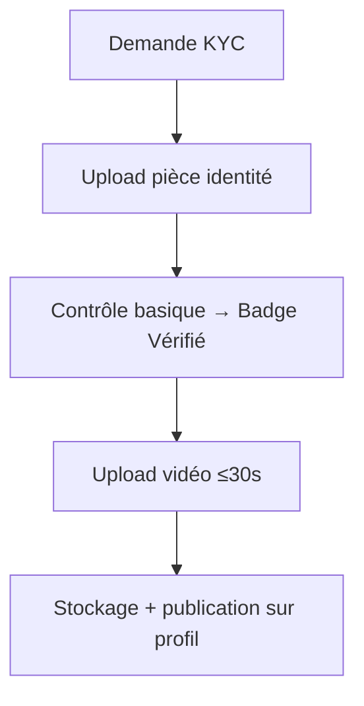

#### 7.4.2 Groupes collaboratifs + Tâches

**Titre du diagramme :** Collaboration en groupe – version 1.2
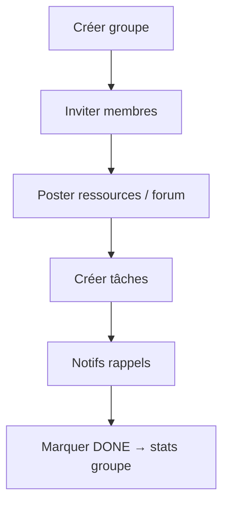

#### 7.4.3 Mode hors-ligne (profils + historique chat)

**Titre du diagramme :** Expérience hors-ligne – version 1.2
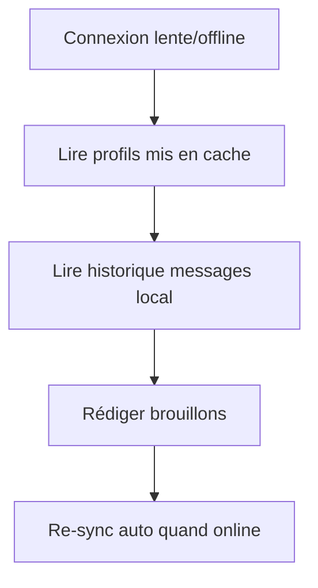

---

### 7.5 Flows — v2.0 (Premium & avancé)

#### 7.5.1 Classe virtuelle (WebRTC) + Breakout rooms

**Titre du diagramme :** Déroulé d’une classe virtuelle – version 2.0
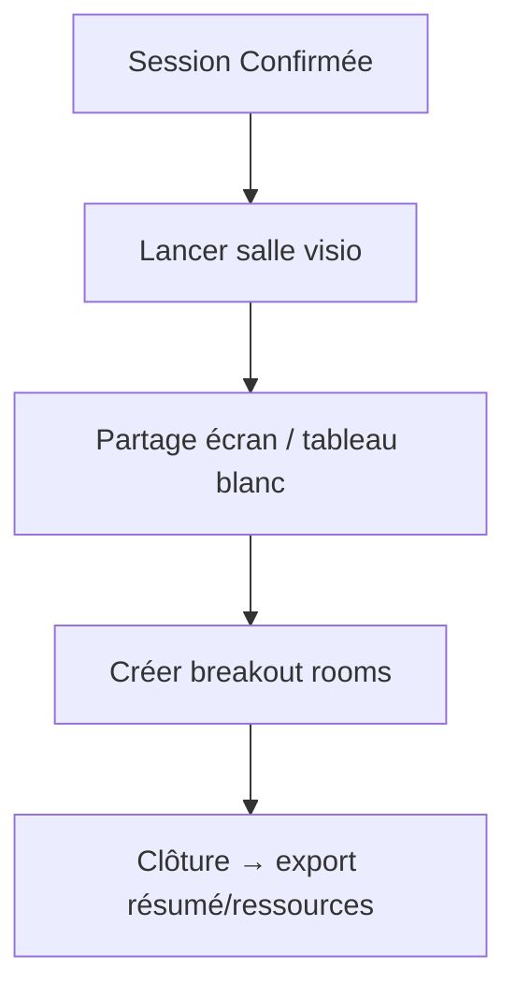

#### 7.5.2 Abonnements & Paiements

**Titre du diagramme :** Cycle de souscription premium – version 2.0
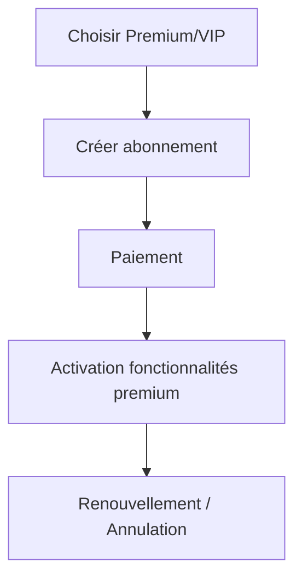
-->
      string email
      string photoUrl
      number reputation
      number points
      number reliabilityScore
      boolean idVerified
      string[] roles
      string preferredLang
    }

    SKILL {
      string _id
      string userId
      string label
      enum type "TEACH|LEARN"
      enum level "BEGINNER|INTERMEDIATE|ADVANCED"
    }

    MEDIA {
      string _id
      string userId
      enum type "INTRO_VIDEO|DOC|IMAGE|AUDIO"
      string url
      number durationSec
      datetime createdAt
    }

    SESSION {
      string _id
      string userAId
      string userBId
      datetime startAt
      datetime endAt
      string placeOrLink
      enum status "PROPOSED|CONFIRMED|DONE|CANCELLED|NO_SHOW"
      boolean translatedChat
    }

    MESSAGE {
      string _id
      string sessionId
      string senderId
      string text
      string audioUrl
      string fileUrl
      string translatedText
      string lang
      datetime createdAt
    }

    GROUP {
      string _id
      string name
      string adminId
      string[] members
      string description
    }

    TASK {
      string _id
      string groupId
      string title
      string description
      datetime deadline
      enum status "TODO|IN_PROGRESS|DONE"
      string attachmentUrl
    }

    REVIEW {
      string _id
      string sessionId
      string reviewerId
      string revieweeId
      number stars
      number punctuality
      number pedagogy
      number motivation
      number communication
      string comment
      datetime createdAt
    }

    BADGE {
      string _id
      string name
      string description
      string icon
    }

    RANKING {
      string _id
      string userId
      enum timeframe "DAILY|WEEKLY|MONTHLY|YEARLY|ALL_TIME"
      number score
      string role "TEACHER|LEARNER"
    }
  ```
  -->

  ## 3.4 Diagramme des microservices (MVP)

  **Titre du diagramme :** Flux microservices – MVP v1.0 uniquement
  ```mermaid
  flowchart LR
    App[App Mobile] -->|HTTPS/JSON| API[API Gateway]

    subgraph MVP Services
      Auth[Auth & Users]
      Match[Skills & Matching]
      Chat[Chat (texte 1-1)]
      Sess[Sessions]
      Rev[Reviews]
      Notif[Notifications]
      Admin[Admin & Modération]
    end

    API --> Auth
    API --> Match
    API --> Chat
    API --> Sess
    API --> Rev
    API --> Notif
    API --> Admin

    Match --> Auth
    Chat --> Auth
    Sess --> Auth
    Rev --> Sess
    Notif --> Sess
  ```

  ### Modèle de données (MVP)

  **Titre du diagramme :** Modèle conceptuel des données – MVP v1.0
  ```mermaid
  erDiagram
    USER ||--o{ SKILL : possede
    USER ||--o{ SESSION : participe
    SESSION ||--o{ MESSAGE : contient
    SESSION ||--o{ REVIEW : genere
    USER ||--o{ REVIEW : redige
    USER ||--o{ NOTIFICATION : recoit
    USER ||--o{ REPORT : soumet

    USER {
      string _id
      string name
      string email
      string photoUrl
      string bio
      string preferredLang
      string locationApprox
      string role "LEARNER|TEACHER|BOTH"
    }

    SKILL {
      string _id
      string userId
      string label
      enum type "TEACH|LEARN"
      enum level "BEGINNER|INTERMEDIATE|ADVANCED"
      string availability
    }

    SESSION {
      string _id
      string proposerId
      string inviteeId
      datetime startAt
      datetime endAt
      string placeOrLink
      enum status "PROPOSED|CONFIRMED|DONE|CANCELLED|NO_SHOW"
    }

    MESSAGE {
      string _id
      string sessionId
      string senderId
      string text
      string lang
      datetime createdAt
    }

    REVIEW {
      string _id
      string sessionId
      string reviewerId
      string revieweeId
      number stars
      number punctuality
      number pedagogy
      number motivation
      number communication
      datetime createdAt
    }

    NOTIFICATION {
      string _id
      string userId
      string type
      datetime sentAt
      string channel "PUSH|EMAIL"
      string status "SENT|PENDING|FAILED"
    }

    REPORT {
      string _id
      string reporterId
      string reportedUserId
      string reason
      string status "OPEN|IN_REVIEW|RESOLVED"
      datetime createdAt
    }
  ```
| **File Storage (certificats)**    | Upload diplômes, images.                     | Relié aux profils Users.                              |
| **Content Reporting**             | Signalement contenu/messages.                | Relié à Chat et Admin.                                |
| **Gamification v1**               | Points de base, classement Top 10.           | Collecte d’événements depuis Sessions, Reviews, Chat. |
| **Translation Service (basique)** | Traduction du chat.                          | Relié à Chat.                                         |

**Titre du diagramme :** Architecture des microservices – Version 1.1
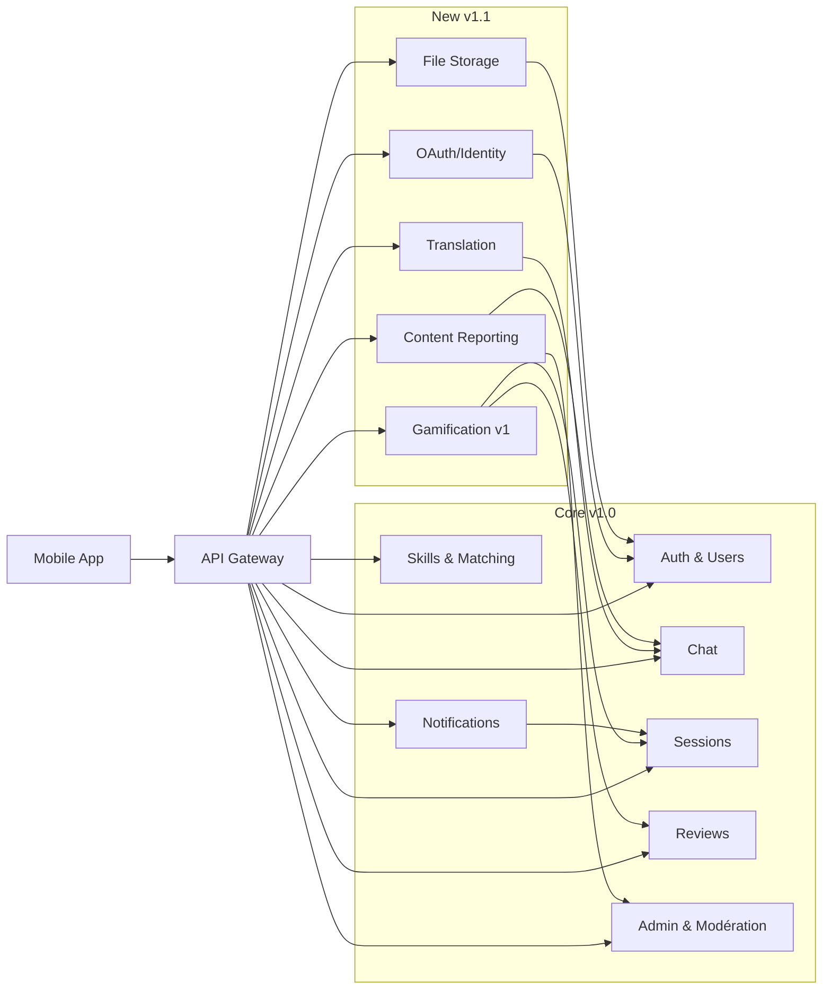


## Explication — v1.1

1. On ajoute **OAuth/OTP**, **Fichiers**, **Gamification v1**, **Traduction basique**, **Signalement contenu**.
2. **OAuth** gère la connexion et met à jour le profil côté **Auth**.
3. **Fichiers** stocke pièces jointes et certificats ; **Chat** y référence les documents.
4. **Gamification** écoute les **événements** (sessions, avis, messages) et met à jour les points/classements sans bloquer l’usage.
---

### Version 1.2 – Engagement et communauté

| Microservice              | Rôle                                                  | Interactions principales       |
| ------------------------- | ----------------------------------------------------- | ------------------------------ |
| **KYC léger**             | Vérification identité (badge vérifié).                | Relié à Users.                 |
| **Video Profiles**        | Mini-vidéo de présentation ≤30s.                      | Relié à File Storage.          |
| **Offline Mode**          | Consultation profils/messages hors ligne.             | Relié à Cache local.           |
| **Groups & Tasks**        | Groupes collaboratifs, forums, tâches avec deadlines. | Relié à Users et File Storage. |
| **Gamification v2**       | Stats personnelles, badges, votes utiles.             | Améliore Gamification v1.      |
| **Content Moderation AI** | Détection contenu frauduleux.                         | Relié à Chat et Groups.        |

**Titre du diagramme :** Architecture des microservices – Version 1.2
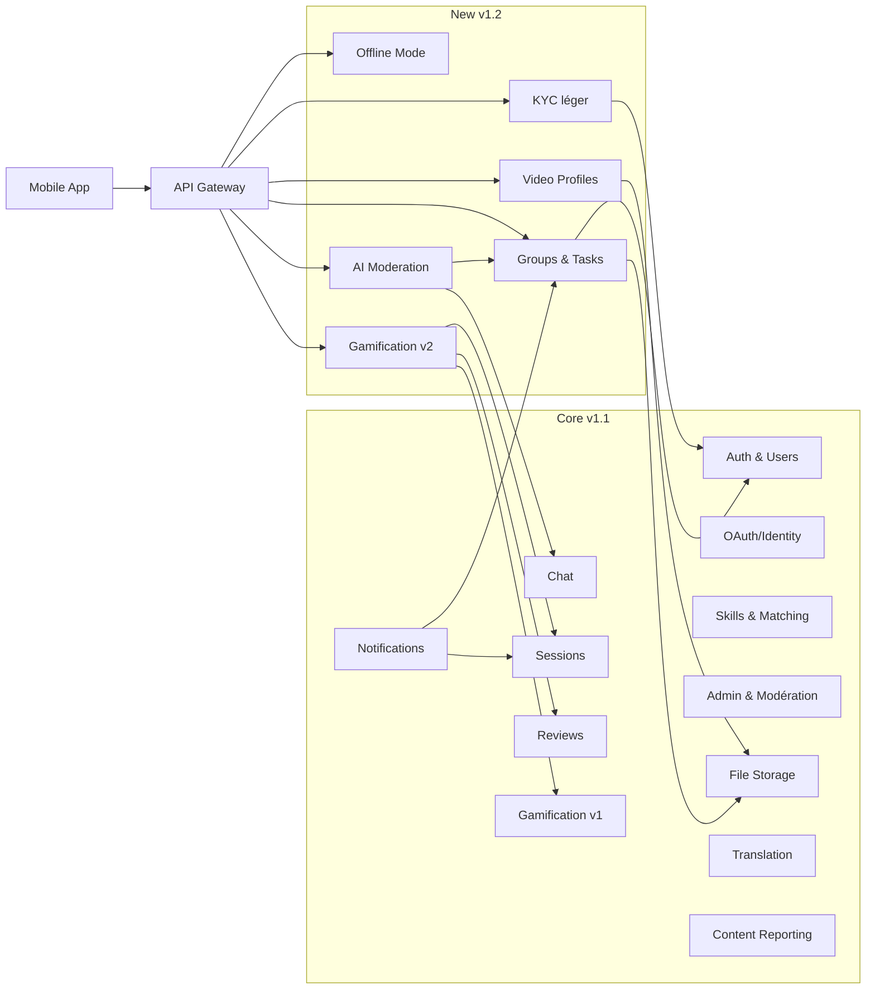

---

## Explication — v1.2

1. On ajoute **KYC**, **Vidéo profil**, **Mode hors-ligne**, **Groupes & Tâches**, **Gamification v2**, **Modération IA**.
2. **KYC** pose un badge vérifié dans **Auth** ; **Vidéo profil** passe par **Fichiers**.
3. **Groupes & Tâches** utilisent **Auth** (rôles) et **Fichiers** (ressources).
4. **Modération IA** analyse **Chat**/**Groupes** en arrière-plan et signale à **Admin** en cas de problème.
---

### Version 2.0 – Premium et avancé

| Microservice               | Rôle                                                      | Interactions principales                |
| -------------------------- | --------------------------------------------------------- | --------------------------------------- |
| **Video & Virtual Class**  | Visioconférences WebRTC, tableau blanc, breakout rooms.   | Relié à Sessions et Groups.             |
| **Voice Messages**         | Messages vocaux dans le chat.                             | Relié à Chat.                           |
| **Gamification v3**        | Classements avancés (daily, weekly, monthly…), fiabilité. | Collecte événements globaux.            |
| **Premium Subscriptions**  | Gestion abonnements Premium/VIP.                          | Relié à Payments.                       |
| **AI Mentor/Prof/Student** | Parcours personnalisés, aide aux devoirs, quiz.           | Relié à Users et Sessions.              |
| **AI Translation avancée** | Traduction illimitée multilingue.                         | Relié à Chat et Groups.                 |
| **Payments**               | Abonnements, institutions (écoles/universités).           | Relié à Users et Premium Subscriptions. |

**Titre du diagramme :** Architecture des microservices – Version 2.0
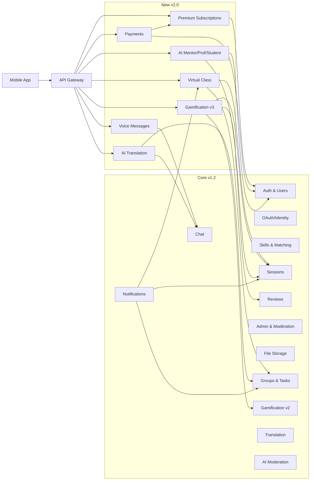
## Explication — v2.0

1. On ajoute **Classe virtuelle**, **Vocal**, **Gamification v3**, **Abonnements**, **Paiements**, **Agents IA**, **Traduction avancée**.
2. **Classe virtuelle** s’attache à une **Session** ou un **Groupe** ; **Vocal** s’intègre au **Chat**.
3. **Abonnements** s’appuient sur **Paiements** ; les droits actifs sont stockés côté **Auth**.
4. **Agents IA** utilisent les données autorisées (profil/sessions) pour aider, sans bloquer le reste de l’app.
---
-->

## 3.2 Bases de Données

| Microservice              | Base de données                                                  | Justification                                                  |
| ------------------------- | ---------------------------------------------------------------- | -------------------------------------------------------------- |
| **Auth & Users**          | MongoDB                                                          | Flexible, profils + préférences.                               |
| **Skills & Matching**     | MongoDB → Elasticsearch (futur)                                  | MongoDB simple au MVP, Elasticsearch pour recherches avancées. |
| **Chat (texte)**          | MongoDB + Redis (futur)                                          | Mongo pour persistance, Redis pour scalabilité temps réel.     |
| **Sessions**              | MongoDB                                                          | Semi-structuré (dates, statuts, users).                        |
| **Reviews**               | MongoDB                                                          | Stockage souple, critères variables.                           |
| **Notifications**         | Firebase/Expo + Mongo (logs)                                     | Solution scalable pour push/email.                             |
<!-- | **File Storage**          | S3/Drive                                                         | Stockage objets lourds (vidéos, images).                       | -->
<!-- | **Groups & Tasks**        | MongoDB                                                          | Structure flexible (membres, discussions, tâches).             | -->
<!-- | **Gamification**          | MongoDB                                                          | Événements utilisateurs + scores.                              | -->
<!-- | **Video & Virtual Class** | WebRTC/Zoom API (pas de DB interne, juste métadonnées en Mongo). | Pas de stockage natif de flux vidéo.                           | -->
<!-- | **Payments**              | PostgreSQL                                                       | Cohérence forte nécessaire pour transactions financières.      | -->
<!-- | **AI Services**           | APIs externes + MongoDB (logs, feedback IA).                     | IA hébergée externe, persistance locale pour suivi.            | -->

---

## 3.3 Gestion des Données — Modélisation

### MVP (v1.0)

* **Auth & Users**
   * Données : profil (nom, email, photo, langue, rôles, localisation approx).
   * Structure : **doc Mongo `User`**, index **email (unique)**.
   * Usage : login/JWT, affichage profil, contrôle d’accès.

* **Skills & Matching**
   * Données : compétences par user (label, type TEACH/LEARN, niveau, dispo).
   * Structure : **doc Mongo `Skill`** (1..n / user), index **label (texte), type, niveau**.
   * Usage : recherche + filtres, suggestions basiques.

* **Sessions**
   * Données : rendez-vous (participants, dates, lieu/lien, statut).
   * Structure : **doc Mongo `Session`**, index **userAId/userBId, startAt, status**.
   * Usage : planification, changements d’état, déclenchement rappels.

* **Chat (texte)**
   * Données : messages 1–1 (texte, langue, horodatage).
   * Structure : **doc Mongo `Message`** lié à `sessionId`, index **sessionId+createdAt**.
   * Usage : timeline, pagination.

* **Reviews**
   * Données : avis (étoiles + critères, commentaire).
   * Structure : **doc Mongo `Review`**, contrainte **unique (sessionId, reviewerId)**.
   * Usage : réputation/notes de profil.

* **Notifications**
   * Données : journal d’envoi (type, cible, statut).
   * Structure : **doc Mongo `NotificationLog`**, index **userId+sentAt** (TTL possible).
   * Usage : audit des push/email, replays si échec.

* **Admin & Modération**
   * Données : signalements (cible, motif, statut).
   * Structure : **doc Mongo `Report`**, index **status, reportedUserId**.
   * Usage : tri, décision, traçabilité.

---

### Ajouts v1.1

* **OAuth & Identity**
   * Données : liens SSO (provider, providerId), téléphone vérifié (OTP).
   * Structure : **`IdentityLink`**, **`PhoneVerification`**, index **(provider, providerId)** unique / **phone** unique.
   * Usage : connexion simplifiée, renforcement identité.

* **File Storage (métadonnées)**
   * Données : fichiers (type CERTIFICATE/ATTACHMENT, url, mime, taille, scan).
   * Structure : **doc `File`** (blobs sur S3/Drive), index **ownerId+type**.
   * Usage : certificats, pièces jointes de chat.

* **Gamification v1**
   * Données : événements d’activité, tableaux Top10.
   * Structure : **`ActivityEvent`**, **`Leaderboard`**, index **timeframe+score**.
   * Usage : points & classement.

* **Translation (basique)**
   * Données : texte traduit.
   * Structure : champs **`translatedText`, `translatedLang`** sur `Message`.
   * Usage : lecture multilingue à la demande.

---

### Ajouts v1.2

* **KYC léger**
   * Données : statut de vérification (PENDING/APPROVED/REJECTED).
   * Structure : **doc `KYCCheck`** lié à `userId`.
   * Usage : badge vérifié (miroir dans `User.idVerified`).

* **Video Profiles**
   * Données : vidéo ≤30s (url, durée).
   * Structure : **doc `Media` (INTRO_VIDEO)**, blob sur S3.
   * Usage : présentation sur profil.

* **Groups & Tasks**
   * Données : groupes, membres, tâches (statut, deadline).
   * Structure : **`Group`**, **`GroupMembership`**, **`Task`** ; index **groupId, status, deadline**.
   * Usage : forums/organisation en petits groupes.

* **Gamification v2**
   * Données : badges, stats personnelles.
   * Structure : **`Badge`**, **`UserBadge`**, **`UserStats`**.
   * Usage : engagement, reconnaissance.

* **AI Moderation**
   * Données : flags de contenu (score, labels, statut).
   * Structure : **doc `ModerationFlag`** (cible = message/post/fichier).
   * Usage : file d’attente pour revue admin.

---

### Ajouts v2.0

* **Video & Virtual Class**
   * Données : salles (contexte session/groupe), enregistrements.
   * Structure : **`Room`**, **`Recording`** (métas Mongo, médias S3).
   * Usage : cours live, replays.

* **Voice Messages**
   * Données : audio + transcription (option).
   * Structure : champs **`audioUrl`**, `transcript` sur `Message`.
   * Usage : échanges vocaux intégrés au chat.

* **Premium Subscriptions**
   * Données : abonnement (plan, statut, période), droits actifs.
   * Structure : **`Subscription`**, **`Entitlement`** (Mongo/PG).
   * Usage : activation des features premium.

* **Payments (PostgreSQL)**
   * Données : intents, factures, client, statuts.
   * Structure : tables **`payment_intent`**, **`invoice`**, FK `user_id`.
   * Usage : encaissement, conformité.

* **AI Agents / Translation avancée**
   * Données : sessions d’IA, messages, feedback ; logs de traduction.
   * Structure : **`AiSession`**, **`AiMessage`**, **`AiFeedback`**.
   * Usage : mentorat, aide pédagogique, meilleure traduction.

<!--
### Ajouts v1.1

* **OAuth & Identity**
  * Données : liens SSO (provider, providerId), téléphone vérifié (OTP).
  * Structure : **`IdentityLink`**, **`PhoneVerification`**, index **(provider, providerId)** unique / **phone** unique.
  * Usage : connexion simplifiée, renforcement identité.

* **File Storage (métadonnées)**
  * Données : fichiers (type CERTIFICATE/ATTACHMENT, url, mime, taille, scan).
  * Structure : **doc `File`** (blobs sur S3/Drive), index **ownerId+type**.
  * Usage : certificats, pièces jointes de chat.

* **Gamification v1**
  * Données : événements d’activité, tableaux Top10.
  * Structure : **`ActivityEvent`**, **`Leaderboard`**, index **timeframe+score**.
  * Usage : points & classement.

* **Translation (basique)**
  * Données : texte traduit.
  * Structure : champs **`translatedText`, `translatedLang`** sur `Message`.
  * Usage : lecture multilingue à la demande.

---

### Ajouts v1.2

* **KYC léger**
  * Données : statut de vérification (PENDING/APPROVED/REJECTED).
  * Structure : **doc `KYCCheck`** lié à `userId`.
  * Usage : badge vérifié (miroir dans `User.idVerified`).

* **Video Profiles**
  * Données : vidéo ≤30s (url, durée).
  * Structure : **doc `Media` (INTRO_VIDEO)**, blob sur S3.
  * Usage : présentation sur profil.

* **Groups & Tasks**
  * Données : groupes, membres, tâches (statut, deadline).
  * Structure : **`Group`**, **`GroupMembership`**, **`Task`** ; index **groupId, status, deadline**.
  * Usage : forums/organisation en petits groupes.

* **Gamification v2**
  * Données : badges, stats personnelles.
  * Structure : **`Badge`**, **`UserBadge`**, **`UserStats`**.
  * Usage : engagement, reconnaissance.

* **AI Moderation**
  * Données : flags de contenu (score, labels, statut).
  * Structure : **doc `ModerationFlag`** (cible = message/post/fichier).
  * Usage : file d’attente pour revue admin.

---

### Ajouts v2.0

* **Video & Virtual Class**
  * Données : salles (contexte session/groupe), enregistrements.
  * Structure : **`Room`**, **`Recording`** (métas Mongo, médias S3).
  * Usage : cours live, replays.

* **Voice Messages**
  * Données : audio + transcription (option).
  * Structure : champs **`audioUrl`**, `transcript` sur `Message`.
  * Usage : échanges vocaux intégrés au chat.

* **Premium Subscriptions**
  * Données : abonnement (plan, statut, période), droits actifs.
  * Structure : **`Subscription`**, **`Entitlement`** (Mongo/PG).
  * Usage : activation des features premium.

* **Payments (PostgreSQL)**
  * Données : intents, factures, client, statuts.
  * Structure : tables **`payment_intent`**, **`invoice`**, FK `user_id`.
  * Usage : encaissement, conformité.

* **AI Agents / Translation avancée**
  * Données : sessions d’IA, messages, feedback ; logs de traduction.
  * Structure : **`AiSession`**, **`AiMessage`**, **`AiFeedback`**.
  * Usage : mentorat, aide pédagogique, meilleure traduction.
-->

<!--

## 3.4 Diagramme global (MVP + évolutions)

**Titre du diagramme :** Vue d’ensemble des évolutions microservices
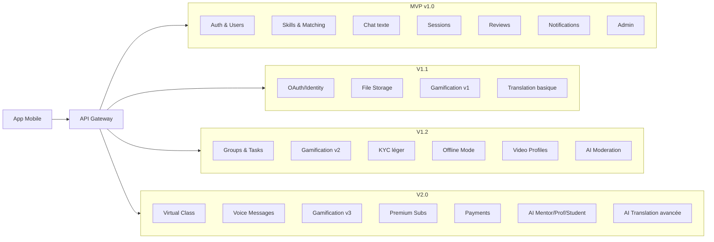

### Modèle de données (simplifié)

**Titre du diagramme :** Modèle conceptuel des données principales
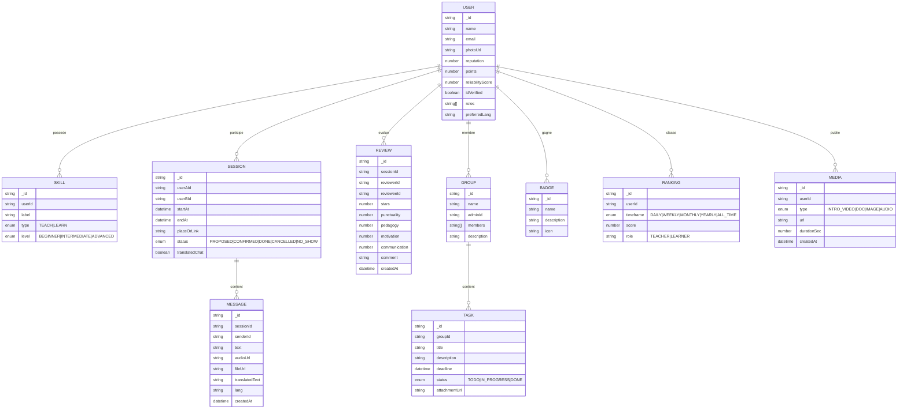
-->

---

## 4. Processus de Création

### Conception

* Besoins utilisateurs & institutions, personas (étudiant, prof, mentor, école).
* Wireframes Figma : profils, matching, chat 1-1 texte, planification de session, écran d’évaluation.
* UX : parcours MVP fluide (inscription → profil → matching → chat → session → évaluation) avec rappels clairs.
* Accessibilité & internationalisation (i18n).

### Développement

* **Frontend** : React Native (Expo), TypeScript, i18n, stockage local léger (AsyncStorage) pour cache profil/token.
* **Backend** : Node.js, Express (REST), Socket.io (chat/notifications), Mongoose (MongoDB).
<!-- * **Vidéo** : WebRTC/Zoom SDK. -->
<!-- * **Fichiers** : S3/Drive, antivirus scan, limites de taille. -->
<!-- * **IA** : LLMs (Assistant Prof/Mentor/Étudiant), **traduction chat** en temps réel, modération. -->
* **Auth** : JWT email/mot de passe, vérification email, sécurisation API (Helmet, rate-limit, CORS).
<!-- * **Gamification** : microservice scoring/ranking, jobs CRON pour classements (daily/weekly…). -->

### Test

* Unitaires : matching compétences, validation session (statuts), logique de notifications, signalement.
* Intégration : Auth JWT + vérif email, chat Socket.io, création/confirmation session, envoi notifications.
* E2E mobile (Detox) : onboarding → matching → chat 1-1 texte → planification session → rappel → review.
* Charge : conversations 1-1 simultanées + rafales de notifications.
* Sécurité : validation stricte, XSS, rate-limit, contrôle d’accès (sessions, signalements).

### Déploiement

* Backend : Docker + Railway/Render/Fly, secrets managés.
* DB : MongoDB Atlas (backup, IP allowlist).
* Mobile : Expo EAS Build + EAS Update (OTA).
* Observabilité : logs (pino), Sentry, métriques (Prometheus/Grafana).

### Maintenance

* CI/CD GitHub Actions (lint/test/build/deploy).
* Roadmap ouverte (Issues, votes “feature requests”).
* Politique de versions (semver), changelog, releases.
<!-- * Amélioration continue IA & traduction (qualité, latence, coût). -->

---

## 5. Acteurs et Parties prenantes

* **Acteurs**

  * Dev mobile (RN/Expo), dev backend (Node/Express), IA/ML, DevOps.
  * QA/Test, Modération & Support.
  * Utilisateurs finaux (apprenants, enseignants), Admins de groupes.
  <!-- * Écoles/Universités (admins établissement). -->

* **Parties prenantes**

  * Communautés locales, associations.
  * Stores mobiles, partenaires IA et visioconf, hébergeurs cloud.

---

## 6. Outils et Protocoles

* **Gestion** : Agile/Scrum, GitHub Projects, PR reviews.
* **Design** : Figma, Mermaid.
* **Stack** : React Native (Expo), Node.js, Express, MongoDB, Socket.io.
* **Qualité** : ESLint, Prettier, Jest, RTL, Supertest, Detox.
* **Sécurité** : HTTPS, JWT, Helmet, RGPD, secrets manager.
* **CI/CD** : GitHub Actions, Docker, Sentry, Prometheus/Grafana.

---

## 7. Profils & User Flows (par version)

### 7.1 Profils cibles

* **Apprenant (Learner)** : cherche à apprendre une compétence.
* **Enseignant (Teacher)** : propose d’enseigner une compétence.
* **Dual-mode (Learner↔Teacher)** : alterne les deux rôles.
* **Admin/Modération** : surveille, modère, gère les signalements.
<!-- * **Établissement (v2.0)** : admin d’une école/université (premium). -->

---

### 7.2 Flows — MVP (v1.0)

#### 7.2.1 Flow Apprenant (MVP)

**Titre du diagramme :** Parcours utilisateur – apprenant v1.0
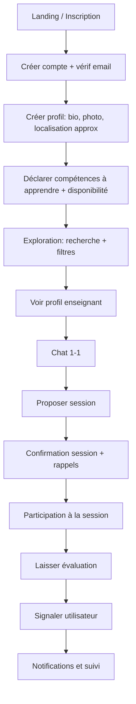

#### 7.2.2 Flow Enseignant (MVP)

**Titre du diagramme :** Parcours utilisateur – enseignant v1.0
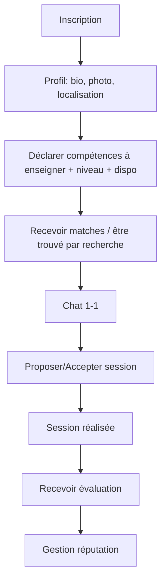

#### 7.2.3 Flow Admin & Modération (MVP)

**Titre du diagramme :** Processus de modération administrateur – MVP
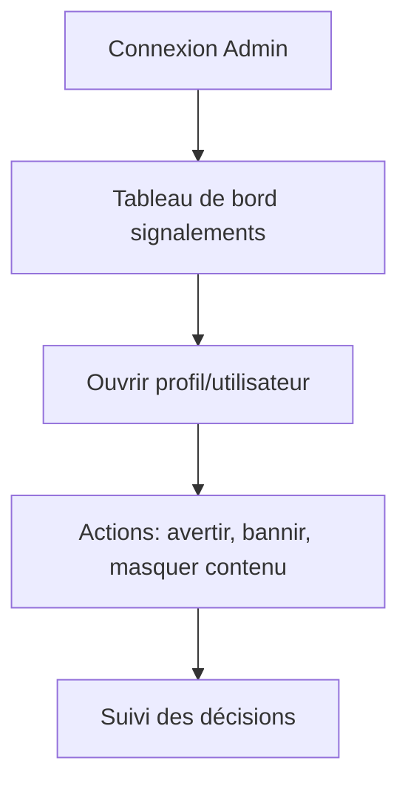
<!--

---

### 7.3 Flows — v1.1 (Confiance & utilisabilité)

#### 7.3.1 OAuth + Vérif téléphone + Certificats

**Titre du diagramme :** Renforcement de la confiance – parcours v1.1


#### 7.3.2 Chat avec fichiers + Traduction basique

**Titre du diagramme :** Enrichissement du chat – fonctionnalités v1.1


#### 7.3.3 Gamification v1 (points + Top 10)

**Titre du diagramme :** Boucle de gamification – version 1.1


---

### 7.4 Flows — v1.2 (Engagement & communauté)

#### 7.4.1 KYC léger + Vidéo de présentation

**Titre du diagramme :** Parcours de confiance avancé – version 1.2


#### 7.4.2 Groupes collaboratifs + Tâches

**Titre du diagramme :** Collaboration en groupe – version 1.2
```mermaid
flowchart TD
  A[Créer groupe] --> B[Inviter membres]
  B --> C[Poster ressources / forum]
  C --> D[Créer tâches]
  D --> E[Notifs rappels]
  E --> F[Marquer DONE → stats groupe]
```

#### 7.4.3 Mode hors-ligne (profils + historique chat)

**Titre du diagramme :** Expérience hors-ligne – version 1.2
```mermaid
flowchart TD
  A[Connexion lente/offline] --> B[Lire profils mis en cache]
  B --> C[Lire historique messages local]
  C --> D[Rédiger brouillons]
  D --> E[Re-sync auto quand online]
```

---

### 7.5 Flows — v2.0 (Premium & avancé)

#### 7.5.1 Classe virtuelle (WebRTC) + Breakout rooms

**Titre du diagramme :** Déroulé d’une classe virtuelle – version 2.0
```mermaid
flowchart TD
  A[Session Confirmée] --> B[Lancer salle visio]
  B --> C[Partage écran / tableau blanc]
  C --> D[Créer breakout rooms]
  D --> E[Clôture → export résumé/ressources]
```

#### 7.5.2 Abonnements & Paiements

**Titre du diagramme :** Cycle de souscription premium – version 2.0
```mermaid
flowchart TD
  A[Choisir Premium/VIP] --> B[Créer abonnement]
  B --> C[Paiement]
  C --> D[Activation fonctionnalités premium]
  D --> E[Renouvellement / Annulation]
```

---

Gotcha — here’s a **super-simple, paste-ready pack** to replace votre current Use Cases.
I kept only short one-liners + tiny diagrams.

---

## 8. Use Cases (MVP)

### 8.1 MVP (v1.0)

#### Apprenant (Learner)

| ID    | Intention           | Déclencheur → Action         | Résultat                 |
| ----- | ------------------- | ---------------------------- | ------------------------ |
| UC-L1 | Créer un compte     | App → S’inscrire (email+pwd) | Compte actif             |
| UC-L2 | Trouver un prof     | Rechercher + filtres         | Liste pertinente         |
| UC-L3 | Démarrer un échange | Ouvrir profil → “Contacter”  | Conversation créée       |
| UC-L4 | Planifier           | “Proposer une session”       | Session **PROPOSED**     |
| UC-L5 | Être rappelé        | Session confirmée            | Push/email avant session |
| UC-L6 | Évaluer             | Fin de session → Noter       | Avis enregistré          |

#### Enseignant (Teacher)

| ID    | Intention            | Déclencheur → Action                | Résultat                      |
| ----- | -------------------- | ----------------------------------- | ----------------------------- |
| UC-T1 | Se présenter         | Compléter profil + skills           | Profil visible                |
| UC-T2 | Répondre             | Ouvrir chat → répondre              | Conversation active           |
| UC-T3 | Confirmer            | Voir proposition → accepter/refuser | Session **CONFIRMED** / refus |
| UC-T4 | Suivre sa réputation | Consulter notes                     | Score visible                 |

#### Admin

| ID    | Intention   | Déclencheur → Action  | Résultat             |
| ----- | ----------- | --------------------- | -------------------- |
| UC-A1 | Modérer     | Ouvrir un signalement | Décision journalisée |
| UC-A2 | Sanctionner | Bloquer/bannir        | Accès restreint      |

##### Mini-flow MVP

**Titre du diagramme :** Interaction apprenant ↔ enseignant – MVP
```mermaid
sequenceDiagram
actor Learner
actor Teacher
Learner->>API: Recherche + filtres
API-->>Learner: Résultats
Learner->>Teacher: Message (chat)
Teacher-->>Learner: Réponse
Learner->>API: Proposer session
API-->>Teacher: Notification
Teacher->>API: Confirmer
API-->>Learner: Rappel auto
Learner->>API: Laisser review
```

---

<!--

### 8.2 v1.1 (Confiance & utilisabilité)

| ID       | Intention           | Action brève             | Résultat           |
| -------- | ------------------- | ------------------------ | ------------------ |
| UC-ID1   | Login simplifié     | OAuth Google / Email+OTP | Connecté           |
| UC-ID2   | + Sécurité          | Vérif téléphone (OTP)    | Numéro validé      |
| UC-DOC1  | Prouver compétences | Upload certificat        | Badge “Certificat” |
| UC-CHAT1 | Partager fichier    | Pièce jointe dans chat   | Fichier dispo      |
| UC-TR1   | Comprendre          | Traduire un message      | Texte traduit      |
| UC-GAM1  | Motiver             | Gagner points            | Top 10 mis à jour  |

##### Mini-flow v1.1

**Titre du diagramme :** Chaîne de valeur fonctionnalités – version 1.1
```mermaid
flowchart LR
  U[Utilisateur] -->|Login| O[OAuth/OTP]
  O --> P[Profil]
  P -->|Upload| C[Certificat]
  P -->|Chat| F[Pièce jointe]
  P -->|Bouton| T[Traduire]
  P -->|Actions| G[Points/Top10]
```

---

### 8.3 v1.2 (Engagement & communauté)

| ID        | Intention           | Action brève                   | Résultat          |
| --------- | ------------------- | ------------------------------ | ----------------- |
| UC-KYC1   | Inspirer confiance  | KYC léger                      | Badge “Vérifié”   |
| UC-VID1   | Se présenter        | Vidéo ≤30s                     | Vidéo sur profil  |
| UC-GRP1   | Apprendre en groupe | Créer groupe                   | Espace actif      |
| UC-TASK1  | Organiser           | Créer tâche + deadline         | Suivi des tâches  |
| UC-OFF1   | Continuer offline   | Lire cache / rédiger brouillon | Sync auto ensuite |
| UC-AIMOD1 | Propreté            | Modération IA                  | Contenu flaggé    |

##### Mini-flow v1.2

**Titre du diagramme :** Orchestration des nouveautés – version 1.2
```mermaid
flowchart TD
  U[Utilisateur] --> KY[KYC léger]
  U --> VP[Vidéo profil]
  U --> GRP[Créer groupe]
  GRP --> T[Ajouter tâches]
  U --> OFF[Mode hors-ligne]
  AI[Modération IA] -->|flags| ADM[Admin]
```

---

### 8.4 v2.0 (Premium & avancé)

| ID          | Intention            | Action brève            | Résultat          |
| ----------- | -------------------- | ----------------------- | ----------------- |
| UC-VIDROOM1 | Donner cours en live | Ouvrir classe virtuelle | Salle active      |
| UC-VOICE1   | Échanger en vocal    | Envoyer vocal           | Audio dans chat   |
| UC-SUB1     | Passer Premium       | Choisir plan + payer    | Avantages activés |
| UC-PAY1     | Gérer paiement       | Voir/annuler abonnement | Facturation OK    |
| UC-AI1      | Être guidé           | Lancer Mentor IA        | Recos/quiz        |
| UC-TR2      | Traduire mieux       | Traduction avancée      | Texte enrichi     |

##### Mini-flow v2.0

**Titre du diagramme :** Parcours premium et services avancés – version 2.0
```mermaid
sequenceDiagram
actor User
User->>API: Choisir Premium
API->>Payments: Créer paiement
Payments-->>API: OK (webhook)
API-->>Auth: Activer droits
User->>VirtualClass: Rejoindre salle
VirtualClass-->>User: Audio/vidéo ok
User->>Chat: Envoyer vocal
```
-->

---

## 10. Critères d’acceptation (échantillons MVP)

* **Recherche (UC-L01)** : filtrer par compétence, niveau, langue, rayon; résultats < 1s sur 10k profils; aucun résultat → message d’aide.
* **Chat (UC-L02)** : première réponse push reçue en < 3s; persistance des messages.
* **Session (UC-L03)** : statut passe PROPOSED→CONFIRMED; rappels J-1 et H-1.
* **Évaluation (UC-L04)** : une seule review par session et par utilisateur; modification permise < 24h.
* **Signalement (UC-L05)** : ticket créé, visibilité admin seulement; SLA tri < 24h.

---

<!--
## Gamification & Ranking

### Classements

* Enseignants & apprenants : Daily, Weekly, Monthly, Yearly, All Time (Top 10 + progression).

### Points (exemples)

* Profil complet +50, Déclarer une compétence +20, Participer +30, Enseigner +50,
  Terminer tâche +40, Publier ressource +25, Visioconf +35, 5⭐ reçu +100,
  Avis constructif +20, Sondage +30, **Certificat validé +80**, **Annulation tardive −60**.

### Badges (échantillon)

* Mentor du mois, Apprenant persévérant, Réponse utile, Super organisateur,
  Toujours présent, Polyglotte, **Certifié**, **Fiabilité 95%+**.

### Statistiques (temps réel)

* Sessions, tâches, diplômes validés, diffusion du savoir, fiabilité moyenne, langues utilisées (traduction).

### Communauté

* **Proposer une fonctionnalité** (soumissions + votes), points bonus pour contributeurs.

---

## Abonnements & Monétisation

* **Gratuit (80%)** : profils, matching, chat, sessions, traduction chat limitée, certificats basiques.
* **Avancé (Premium)** : stats détaillées, stockage accru, replay vidéos, assistants IA étendus, traduction illimitée.
* **VIP / Établissements** : intégrations LMS/API/SSO, analytics avancées, multi-groupes, branding.

---

## Vision finale

Faire de **SwapSkill** le **hub central du savoir**, alliant **communauté**, **éducation formelle**, **gamification**, **multilingue** et **IA** pour créer un écosystème unique de partage de connaissances — accessible même **hors-ligne**.
-->

```
